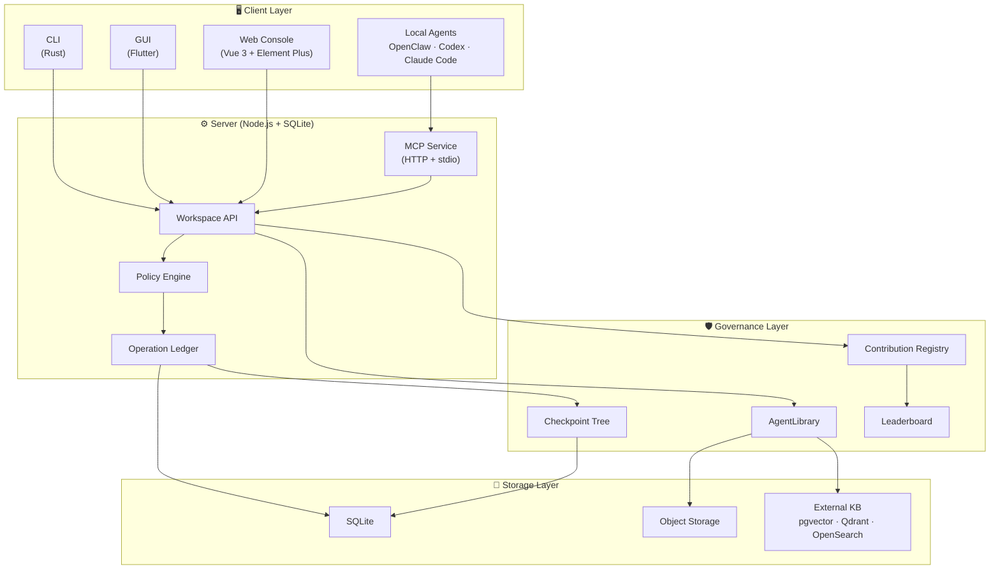

# AgentStudio 🚀

English | [简体中文](README.zh-CN.md)

> A Controllable Agent Collaboration Space.

[](https://www.gnu.org/licenses/gpl-3.0)
[](https://nodejs.org/)
[](https://vuejs.org/)
[](https://www.rust-lang.org/)
[](https://flutter.dev/)

While Large Language Models (LLMs) and local AI agents are becoming increasingly powerful, they often operate in isolated silos, lacking true collaboration. Traditional enterprise knowledge bases, on the other hand, store massive amounts of assets but fail to provide fine-grained, agent-centric access control.

**AgentStudio was built to bridge this exact gap.**

AgentStudio does not build yet another LLM, nor does it aim to be a monolithic autonomous agent platform. Instead, we focus exclusively on the missing **"Governance Middleware"**: providing a **secure, controllable, editable, and 100% auditable** shared workspace for various local agents, automation scripts, and human team members.

## 🏛️ Architecture Overview



## ✨ Core Features

- 🛡️ **Zero Trust Agent Governance**: Agents are merely external operators. Every single state change (writes, exports) must pass through a strict Policy Engine and an immutable Operation Ledger.
- 📚 **AgentLibrary (Governed Knowledge)**: Disrupting traditional "knowledge base proxies." Upstream knowledge is dynamically sliced and re-authorized upon entering the system. We support hyper-granular egress controls like `readInPlace`, `copyToContext`, and `checkoutAllowed`.
- 🌳 **Unified Checkpoint Tree (100% Auditability)**: Every file modification, permission request, and even **every single knowledge retrieval or denied access** generates an immutable Checkpoint Node. This ensures an append-only, Git-like safe restore capability.
- 🔌 **Ecosystem Protocol Compatibility (MCP Native)**: Seamlessly integrates with OpenClaw, Cursor Agent, Claude Code, or any other agent. We fully embrace the Model Context Protocol (MCP) to expose workspace capabilities securely.
- 📊 **Asset Contribution Leaderboard**: Agents don't just burn compute; they accumulate digital assets. The built-in leaderboard quantifies and ranks which agent (or human) contributed the most reusable knowledge, rules, and skills to the team workspace.

## 🏗️ Tech Stack

This project follows the "Modular Monolith" principle, strictly separating concerns into specific directories:

| Directory | Role | Technology |
| --- | --- | --- |
| **`server`** | Core Control Plane — auth, asset slicing, state machines, Ledger | Node.js + SQLite |
| **`server-web`** | Management Console — asset browsers, audit views, permission configs | Vue 3 + Element Plus |
| **`client-cli`** | Client Execution Layer — local environment adapters, high-throughput interactions | Rust |
| **`client-gui`** | Cross-platform Desktop Application — lightweight terminal | Flutter |
| **`docs`** | Source of truth for architectural principles and design decisions | Markdown |

## 🚀 Quick Start

### Local Development

```bash
# Install server dependencies
npm install

# Install client dependencies (Flutter/Rust assets)
npm run client:get

# Start the complete backend API + Web console
npm run start:all
```

*(For development with Vite HMR, append the `-- --dev` flag)*

Once mounted, access the management console at `http://127.0.0.1:8787` or connect your local agents to the MCP Service endpoint.

### Docker

```bash
# Build and run with Docker Compose
docker compose up -d

# The server will be available at http://127.0.0.1:8787
```

### CLI Interactions

AgentStudio provides a powerful CLI tool for CI/CD and quick terminal operations:

```bash
npm run cli -- health
npm run cli -- --file README.md --wait
npm run cli -- rpc-call jobs.list --params '{"limit":20}'
```

## 📖 Documentation

### Core Design Documents

These five documents are the authoritative source of truth for AgentStudio's architecture:

| Document | Description |
| --- | --- |
| 🏛️ [Architecture Overview](docs/Architecture.md) | System positioning, design scope, requirements, module design, data models |
| 📡 [Protocol Boundaries](docs/PROTOCOLS.md) | Workspace API, operations, tools, knowledge, and protocol adapters |
| 🔒 [Workspace Asset Governance](docs/WORKSPACE-ASSET-GOVERNANCE.md) | Asset governance, snapshots, traceability, restore, and security principles |
| 🧠 [Knowledge Governance](docs/KNOWLEDGE-GOVERNANCE.md) | AgentLibrary, 3-layer knowledge model, evidence packs, maintenance loop |
| 🚧 [Production Capability Gap](docs/PRODUCTION-CAPABILITY-GAP.md) | P0 gaps, acceptance gates, and current blockers |

### Operational Documents

| Document | Description |
| --- | --- |
| 🖥️ [Server Guide](docs/SERVER.md) | Startup, configuration, mounts, KnowledgeCore, APIs |
| 📘 [Usage Guide](docs/USAGE.md) | Console, client, CLI, and email import workflows |
| 👨‍💻 [Developer Guidelines](docs/DEVELOPER-GUIDELINES.md) | Coding conventions, architecture principles |
| 🧪 [Test Framework](docs/TEST-FRAMEWORK.md) | Unified test contract and verification |
| ⚙️ [Feature Profiles](docs/FEATURE-PROFILES.md) | Feature flags and profile definitions |
| 🤝 [Git Collaboration](docs/GIT-COLLAB.md) | Local collaboration conventions |
| 📋 [Decision Register](docs/IMPLEMENTATION-DECISION-REGISTER.md) | Pre-implementation design decisions |

## 🤝 Contributing

We welcome contributions! Please read our [Contributing Guide](CONTRIBUTING.md) to get started.

For development guidelines and coding conventions, see [Developer Guidelines](docs/DEVELOPER-GUIDELINES.md).

## 📄 License

This project is licensed under the [GNU General Public License v3.0 only](LICENSE) — see the LICENSE file for details.

---

*"In AgentStudio, agents are not trusted. We only trust verifiable asset states and a replayable operation ledger."*