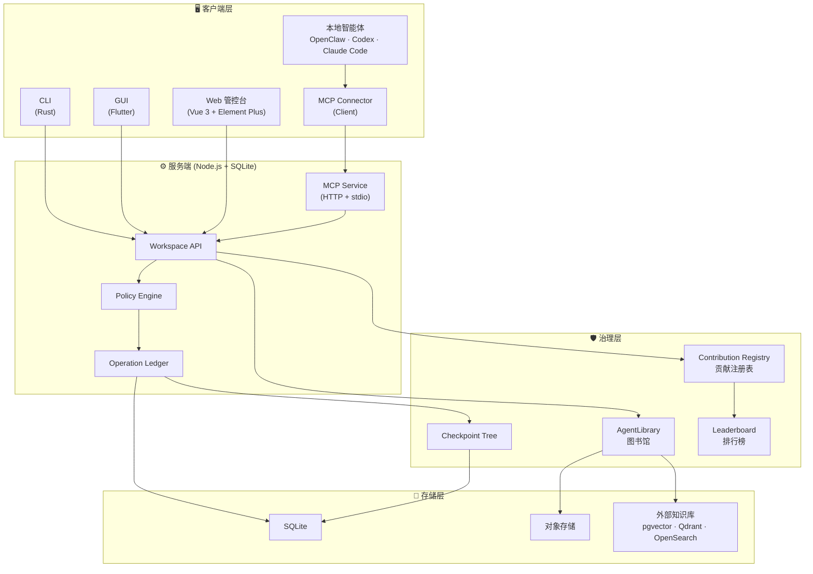

# Pact 🚀

[English](README.md) | 简体中文

> 可控的智能体协作空间。

[](https://www.gnu.org/licenses/gpl-3.0)
[](https://nodejs.org/)
[](https://vuejs.org/)
[](https://www.rust-lang.org/)
[](https://flutter.dev/)

**Pact** 是一个**可信的智能体协作空间**。我们致力于打破本地孤立的智能体与静态企业知识库之间的壁垒，为您提供一个**安全、受控且 100% 可审计**的协同环境。

💡 **核心优势**
- **智能体原生治理**：专为 Agent 设计的细粒度权限管控与动态知识切分机制。
- **打破协同孤岛**：让各类本地智能体、自动化脚本和人类成员实现无缝协同。
- **100% 可审计性**：所有操作与知识访问轨迹均被完整记录，支持安全溯源与回滚。

## 🏛️ 架构概览



## ✨ 核心特性

- 🛡️ **"零信任"智能体治理 (Zero Trust)**：智能体只是外部操作员。系统的每一次状态变更（写入、导出），必须经过极度严格的 Policy Engine 和 Operation Ledger 裁决。
- 📚 **AgentLibrary (受控图书馆)**：颠覆传统的"知识库代理"。上游知识进入系统后会被重新切分与实时再授权。支持 `readInPlace`, `copyToContext`, `checkoutAllowed` 等极细粒度的出馆限制。
- 🌳 **统一 Checkpoint Tree (100% 审计)**：每一次文件修改、权限请求，甚至是**每一次的知识检索和被拒绝的访问**，都会生成不可篡改的 Checkpoint 节点，支持类似 Git 的 Append-only 安全恢复。
- 🔌 **全生态协议兼容 (MCP Native)**：无缝接入 OpenClaw、Cursor Agent、Claude Code 等任何智能体。全面拥抱 Model Context Protocol (MCP) 标准暴露工作空间能力。
- 📊 **资产贡献量化面板**：不仅消耗算力，更沉淀数字资产。系统内置贡献排行榜，量化评估哪个智能体或成员贡献了最具复用价值的知识、规则 (Rules) 和技能 (Skills)。

## 🏗️ 架构与技术栈

本项目遵循"模块化单体 (Modular Monolith)"原则，物理目录按职责严格收敛：

| 目录 | 职责 | 技术栈 |
| --- | --- | --- |
| **`server`** | 核心控制面 — 鉴权、资产切分、状态机与 Ledger | Node.js + SQLite |
| **`server-web`** | 管控台 — 资产浏览器、审计视图和权限配置 | Vue 3 + Element Plus |
| **`client-cli`** | 客户端执行层 — 本地环境适配、高吞吐交互 | Rust |
| **`client-gui`** | 跨端桌面应用 — 轻量化操作终端 | Flutter |
| **`mcp-connector`** | MCP 客户端连接器 — 为本地智能体提供一键安装与连接能力 | Node.js |
| **`docs`** | 核心架构原则与设计决议记录 | Markdown |

## 🚀 快速开始

### 本地开发

```bash
# 安装服务端依赖
npm install

# 安装客户端依赖 (Flutter/Rust 资产)
npm run client:get

# 一键启动完整的服务端 API 与 Web 管控台
npm run start:all
```

*(开发模式请附加 `-- --dev` 参数启用 Vite 热更新)*

默认挂载完成后，即可通过 `http://127.0.0.1:7228` 访问服务端管控台，或通过本地配置的智能体（连接本机的 MCP Service 端点）开始协同操作。

### Docker 部署

```bash
# 使用 Docker Compose 构建并运行
docker compose up -d

# 服务将运行在 http://127.0.0.1:7228
```

### CLI 快速交互

Pact 提供了强大的 CLI 工具以支持 CI/CD 与终端快捷操作：

```bash
npm run cli -- health
npm run cli -- --file README.md --wait
npm run cli -- rpc-call jobs.list --params '{"limit":20}'
```

### MCP 客户端连接器

使用一行命令即可将您的本地智能体 (Codex, Claude Code 等) 连接到 Pact MCP Server：

```bash
npx pact-mcp-connector@latest register
```

*(更多详情请参考 [mcp-connector/README.md](mcp-connector/README.md))*

## 📖 文档体系

### 核心设计文档

以下五份文档是 Pact 架构的权威真相源：

| 文档 | 说明 |
| --- | --- |
| 🏛️ [架构总览 (Architecture)](docs/Architecture.md) | 总定位、设计范围、需求、模块设计、数据模型 |
| 📡 [协议边界 (Protocols)](docs/PROTOCOLS.md) | Workspace API、Operation、工具管理、知识、协议适配 |
| 🔒 [工作空间资产治理 (Workspace Governance)](docs/WORKSPACE-ASSET-GOVERNANCE.md) | 资产治理、快照、溯源、恢复和安全原则 |
| 🧠 [知识治理与 AgentLibrary](docs/KNOWLEDGE-GOVERNANCE.md) | 图书馆、三层知识模型、证据包、维护闭环 |
| 🚧 [生产能力差距 (Capability Gap)](docs/PRODUCTION-CAPABILITY-GAP.md) | P0 差距、验收门禁和当前阻塞项 |

### 运行支持文档

| 文档 | 说明 |
| --- | --- |
| 🖥️ [服务端指南 (Server)](docs/SERVER.md) | 启动、配置、挂载、KnowledgeCore、接口 |
| 📘 [使用说明 (Usage)](docs/USAGE.md) | 控制台、客户端、CLI 和邮件导入工作流 |
| 👨‍💻 [开发者核心守则 (Developer Guidelines)](docs/DEVELOPER-GUIDELINES.md) | 编码规范、架构原则 |
| 🧪 [测试框架 (Test Framework)](docs/TEST-FRAMEWORK.md) | 统一测试契约和验证 |
| ⚙️ [Feature Profiles](docs/FEATURE-PROFILES.md) | 功能开关和 profile 规划 |
| 🤝 [Git 协作约定 (Git Collab)](docs/GIT-COLLAB.md) | 本地协作约定 |
| 📋 [设计决策登记表 (Decision Register)](docs/IMPLEMENTATION-DECISION-REGISTER.md) | 实现前设计决策记录 |

## 🤝 参与贡献

欢迎贡献！请阅读我们的 [贡献指南 (Contributing Guide)](CONTRIBUTING.md) 开始参与。

开发规范请参阅 [开发者核心守则](docs/DEVELOPER-GUIDELINES.md)。

## 📄 许可证

本项目基于 [GNU General Public License v3.0 only](LICENSE) 发布 — 详见 LICENSE 文件。

---

*"在 Pact 中，智能体不被信任。我们只信任可验证的资产状态与可回放的操作账本。"*
