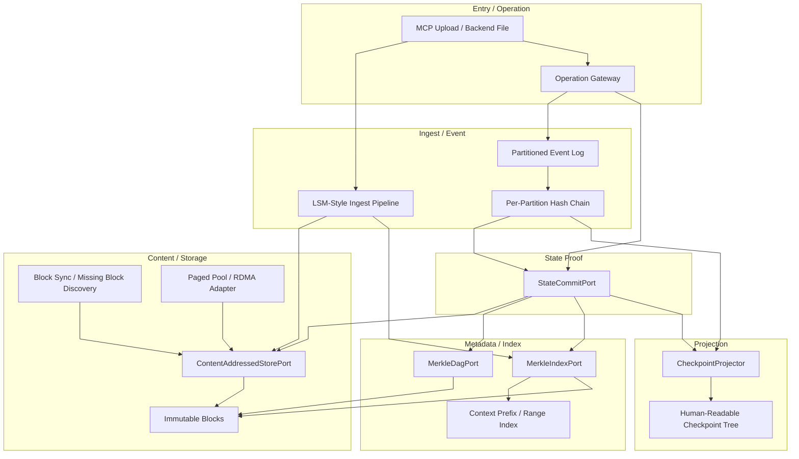
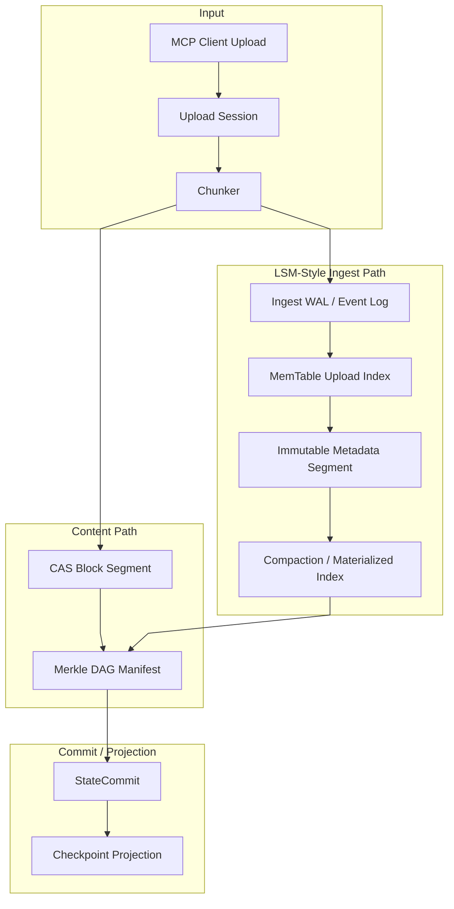
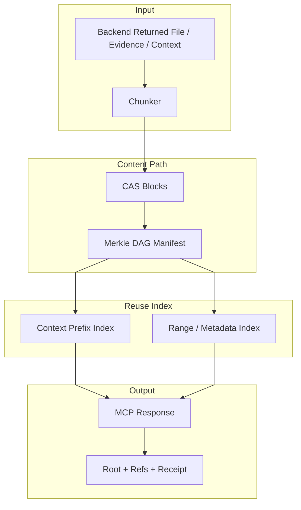

# Pact Checkpoint Algorithm Evolution Plan

本文定义 Pact Checkpoint、缓存、上下文状态、知识块和跨节点迁移能力的算法演进路线。

本文是实施路线图，不是第六份长期核心架构文档。阶段性结论稳定后必须回写到：

- `docs/Architecture.md`
- `docs/PROTOCOLS.md`
- `docs/WORKSPACE-ASSET-GOVERNANCE.md`
- `docs/KNOWLEDGE-GOVERNANCE.md`
- `docs/PRODUCTION-CAPABILITY-GAP.md`

## 1. 结论

用户提出的三层架构方向是合理的，但需要严格分层：

| 层 | 目标定位 | Pact 结论 |
| --- | --- | --- |
| Metadata 层 | 用 Merkle-Radix / Prolly / Merkle DAG 表达可验证逻辑状态 | 必须从 v0.0.1 开始冻结接口和引用模型 |
| Transport 层 | 用 event log 和 hash diff 传递增量，发现 missing blocks | 必须先做本地分区事件流，再演进到跨节点同步 |
| Storage/Network 层 | 用分页池、内存注册、RDMA/RoCEv2 做零拷贝块迁移 | 合理但属于 v2.0.0 以后，不得污染上层状态抽象 |

核心判断：

- 不能先用普通 JSON 状态树实现主链路，再期望后续平滑切换到 Merkle/CAS。那会重写 operation、cache、restore、sync、context 和 knowledge evidence。
- 也不能在 v0.0.1 直接把 RDMA、RoCEv2、显存池做成依赖。它们是物理层 adapter，不是 Pact 状态机语义。
- v0.0.1 必须先固定工业级算法合同：`LSM-style Ingest Pipeline + CAS + Merkle DAG + Merkle Index Family + Partitioned Hash Chain + State Commit`。
- 实现优先级必须是上传留档优先：`LSM-style Ingest Pipeline + CAS durable archive + StateCommit` 是 v0.0.1 P0 阻塞项；下载/回传链路的 Merkle-Radix 高缓存命中率和上下文前缀复用后置。

目标结构：



## 2. 设计原则

| 原则 | 要求 | 禁止 |
| --- | --- | --- |
| 逻辑状态与物理存储分离 | Metadata 只表达 root、key、refs、proof，不依赖文件、SQLite、RDMA 或内存地址 | 在业务 operation 中保存裸路径、裸内存地址、裸后端对象 |
| 上传留档优先 | MCP 客户端上传链路先完成可恢复留档、断点续传、崩溃恢复、审计和 state commit | 用下载缓存命中率或上下文压缩优化替代上传可靠性验收 |
| 摄取与内容分离 | LSM-style ingest 只管理上传 session、chunk map、offset、临时索引和 compaction；文件主体进入 CAS/Merkle DAG | 让 LSM 成为大文件主体存储，或让 compaction 改写审计事实 |
| 内容寻址优先 | 大对象、上下文、知识 evidence、artifact、cache value 都先进入 CAS | 缓存不可验证的 mutable object |
| 真实存储语义 | 对外状态必须区分 `queued`、`staged`、`archived`、`committed`、`synced`、`projected`、`cached`、`contractVerified`；只有真实字节进入 CAS/manifest/state commit 或外部 provider 返回持久化确认后，才能称为已保存、已备份或已同步 | 把链接、队列、projection、mock、cache hit、provider ref 当成真实存储事实 |
| 事件是事实源 | 外部可见操作先进入 event log，再生成 state commit 和 checkpoint projection | 把 UI checkpoint tree 当事实源 |
| 索引族可替换 | 业务只依赖 `MerkleIndexPort`，Radix、Patricia、Prolly 是实现族 | 在 sharedspace/knowledge/codespace 写死具体树节点结构 |
| 增量同步优先 | 同步协议只传 root、event 和 missing blocks | 全量复制整个 workspace 或 checkpoint tree |
| 单机先落地 | v0.0.1 使用本地 CAS、本地 event log、本地索引实现 | 早期强依赖 RDMA、RoCEv2、外部对象存储或分布式队列 |

## 3. 三层目标架构

### 3.1 Metadata Layer

Metadata 层是纯逻辑层，负责表达可验证状态。

| 结构 | Pact 用途 | 选择理由 |
| --- | --- | --- |
| Merkle DAG | 文件集、context bundle、knowledge evidence bundle、artifact manifest | 天然内容寻址、去重、可验证缺块 |
| Merkle-Radix / Patricia | workspace path、capability namespace、permission path、agent context prefix | 适合前缀匹配和路径压缩 |
| Prolly Tree | 大量有序 metadata、目录 listing、知识索引 manifest、版本 diff | 适合结构共享、历史无关、快速 diff |
| Hash Chain | 单分区事件顺序、audit tamper evidence | 轻量、追加友好、适合事件流 |
| LSM-style Ingest Index | 上传 session、chunk offset、临时 chunk map、后台 materialized index | 适合顺序写、断点恢复、批量 flush 和后台 compaction |

Metadata 层必须产出以下稳定引用：

| 引用 | 含义 |
| --- | --- |
| `cid` | 不可变内容块 ID |
| `rootCid` | Merkle DAG 根 |
| `indexRootCid` | 索引根 |
| `eventHash` | 事件 hash |
| `beforeRoot` | operation 之前的 state root |
| `afterRoot` | operation 之后的 state root |
| `contentRefs` | operation 引用或生成的内容块集合 |

### 3.2 Transport Layer

Transport 层负责跨进程、跨节点、跨版本传输增量。

| 能力 | v0.0.1 | 后续演进 |
| --- | --- | --- |
| Event Log | 本地分区 append-only log | 跨节点复制、订阅、恢复 |
| Missing Block Discovery | 本地 verifier 检查 root 下缺块 | 双端 root/hash 比对，只拉缺失块 |
| Block Transfer | 本机文件 copy / stream | HTTP range、TCP、RDMA、NVMe-oF |
| Consistency | 单分区 hash chain | 多分区 vector clock / causal frontier |
| Resume | offset + root + missing block list | 可断点恢复的跨节点状态迁移 |

Transport 层的最小协议对象：

| 对象 | 字段 |
| --- | --- |
| `EventRecord` | `eventId`、`partitionId`、`offset`、`prevEventHash`、`eventHash`、`operationId`、`beforeRoot`、`afterRoot`、`contentRefs`、`createdAt` |
| `RootAdvertise` | `workspaceId`、`rootKind`、`rootCid`、`eventHash`、`partitionFrontier` |
| `BlockInventory` | `rootCid`、`knownCids`、`missingCids`、`proofMode` |
| `BlockTransferPlan` | `sourceNode`、`targetNode`、`cids`、`byteLength`、`transport`、`resumeToken` |

### 3.3 Storage / Network Layer

Storage/Network 层负责物理块管理。它不能向 Metadata 层泄漏硬件细节。

| 能力 | v0.0.1 | v1.x | v2.x |
| --- | --- | --- | --- |
| Block Store | 本地文件 CAS | 可插拔对象存储 adapter | 分层冷热块管理 |
| Page Pool | 不做或只做进程内 slab buffer | 本地 paged pool，支持 pin/ref count | RDMA registered memory / GPU memory adapter |
| Zero Copy | 不承诺 | 同进程 Buffer slice / mmap 实验 | RDMA/RoCEv2、GPUDirect RDMA |
| Network | 无跨节点依赖 | HTTP/TCP block sync | RDMA/RoCEv2 block fill |

长期目标中的 RDMA/RoCEv2 只实现 `BlockTransportAdapter` 和 `PagePoolAdapter`，不得改变 `cid`、`StateCommit`、`EventRecord` 和 `MerkleIndexPort`。

### 3.4 上传链路与回传链路

Pact 的文件和上下文链路必须拆成两个方向优化：

开发优先级固定为：先保证智能体客户端上传到 Pact 的可恢复存档链路，再优化 Pact 从外部服务回传内容时的上下文复用和缓存命中率。后者不得阻塞前者。

| 链路 | 主结构 | 优先级 | 优化目标 | 不做 |
| --- | --- | --- | --- | --- |
| MCP 客户端上传 -> Pact | LSM-style ingest pipeline + CAS block segment | P0 阻塞 | 顺序落盘、断点续传、崩溃恢复、高并发 chunk 写入 | 不把 LSM 当大文件主体事实源 |
| Pact -> 后端服务上传 | CAS root + Merkle DAG manifest + StateCommit | P0 阻塞 | 传输前可验证、可恢复、可审计 | 不绕过 operation/event log |
| 后端文件/evidence 回传 -> Pact | CAS + Merkle DAG + Prefix/Range Index | P1 优化 | 内容去重、缺块发现、上下文前缀复用 | 不缓存不可验证裸文件 |
| Pact -> MCP 客户端回传 | root/ref receipt + 按需 block materialization | P1 优化 | 只回传客户端需要的内容，保留 proof 和 trace | 不默认全量展开所有块 |

上传链路的推荐流程：



回传链路的推荐流程：



关键边界：

- `EventRecord`、`StateCommit`、CAS block 都是不可变事实。
- LSM-style ingest index 可以 flush、merge、compact，但只能合并上传 session 和 chunk metadata 的物化索引。
- Compaction 不得删除、改写或重排已经确认的 audit event、state commit、content block。
- Prefix reuse 不是 Merkle DAG 单独完成的能力；Merkle DAG 提供内容寻址，`MerkleIndexPort` 的 prefix/range 实现负责上下文前缀命中。

## 4. 核心接口合同

### 4.1 CanonicalCodec

目标：相同逻辑 payload 在不同进程、不同平台、不同运行时得到完全相同的 hash。

| 方法 | 语义 |
| --- | --- |
| `encode(value, codec)` | 输出 canonical bytes |
| `decode(bytes, codec)` | 从 canonical bytes 还原逻辑对象 |
| `hash(value, codec, algorithm)` | 输出稳定 hash |
| `normalize(value, schema)` | 字段排序、默认值、时间和 path 规范化 |

验收：

- 对同一 payload 重复 hash 结果一致。
- 对对象字段乱序、等价默认值、不同换行风格的输入，按 schema 得到同一 canonical hash。

### 4.2 ContentAddressedStorePort

目标：所有大对象和缓存值进入不可变块存储。

| 方法 | 语义 |
| --- | --- |
| `putBlock(bytes, metadata)` | 写入不可变 block，返回 `cid` |
| `getBlock(cid)` | 读取 block bytes 和 metadata |
| `hasBlock(cid)` | 检查本地是否存在 |
| `listMissing(rootCid)` | 从 root 遍历，返回缺块 |
| `pin(rootCid, policy)` | 防止 GC |
| `gc(policy)` | 清理未引用块 |

验收：

- 相同 bytes 只存一份。
- 不允许覆盖已有 `cid`。
- root 下任何缺块都能被 verifier 发现。

### 4.3 MerkleDagPort

目标：表达文件集、上下文、知识 evidence、artifact 的结构化内容。

| 方法 | 语义 |
| --- | --- |
| `buildManifest(kind, entries)` | 生成 Merkle DAG manifest |
| `walk(rootCid)` | 遍历 refs |
| `verify(rootCid)` | 验证 root 下所有 block hash |
| `diff(leftRoot, rightRoot)` | 返回差异 refs |

验收：

- 任意 manifest 可从 root 追溯到全部子块。
- 只改一个文件或 chunk 时，未变化块继续复用。

### 4.4 MerkleIndexPort

目标：隐藏 Radix、Patricia、Prolly 的具体实现，让业务依赖索引族接口。

| 方法 | 语义 |
| --- | --- |
| `get(indexRootCid, key)` | 按 key 查找 value ref |
| `put(indexRootCid, key, valueRef)` | 返回新 `indexRootCid` |
| `delete(indexRootCid, key)` | 返回新 `indexRootCid` |
| `scan(indexRootCid, range)` | 有序扫描 |
| `prefix(indexRootCid, prefix)` | 前缀匹配 |
| `diff(leftRoot, rightRoot)` | 返回 key-level diff |
| `prove(indexRootCid, key)` | 返回 inclusion / exclusion proof |

第一版实现策略：

- path/namespace：先做 deterministic sorted chunk trie，再替换为 Merkle-Radix/Patricia。
- 大量有序 metadata：先做 sorted chunk B-tree，再替换为 Prolly Tree。
- 接口和 root/ref shape 不变。

### 4.5 StateCommitPort

目标：把 operation、event log、CAS 和 Merkle index 连接成状态证明。

| 方法 | 语义 |
| --- | --- |
| `begin(operation)` | 读取 `beforeRoot` |
| `stageContent(refs)` | 写入或引用 CAS blocks |
| `applyIndexMutations(mutations)` | 更新 Merkle index root |
| `commit()` | 生成 `StateCommit` 和 `afterRoot` |
| `verifyCommit(commitId)` | 验证 event、content refs、root chain |

`StateCommit` 最小字段：

```json
{
  "commitId": "state_commit_<hash>",
  "parentCommitIds": [],
  "operationId": "op_<id>",
  "eventHash": "sha256:<hash>",
  "beforeRoot": "cid:<root>",
  "afterRoot": "cid:<root>",
  "contentRefs": ["cid:<block>"],
  "indexRoots": {
    "sharedspace": "cid:<root>",
    "knowledge": "cid:<root>",
    "codespace": "cid:<root>"
  },
  "createdAt": "iso-8601"
}
```

### 4.6 CheckpointProjector

目标：把机器友好的状态证明投影成人可读的恢复树。

Checkpoint Tree 不再写入高频事实源，只由 event log 和 state commit 投影生成：

- task/session timeline
- operation summary
- before/after diff
- missing block state
- restore target
- denied access/access receipt

### 4.7 LsmIngestPort

目标：为 MCP 上传链路和后端回传写入提供高吞吐、可恢复、顺序落盘的摄取层。该接口采用 LSM 思想，但只管理 ingest metadata，不直接承载不可变内容事实。

| 方法 | 语义 |
| --- | --- |
| `beginUploadSession(input)` | 创建上传 session，返回 `uploadSessionId` 和初始 offset |
| `appendChunkRecord(sessionId, record)` | 追加 chunk 元数据，chunk bytes 必须已经写入 CAS 或 staging block |
| `flushMemTable(sessionId)` | 将内存中的 session/chunk index 冻结成 immutable segment |
| `compactSegments(scope)` | 合并旧 segment，生成新的 materialized ingest index |
| `recoverSession(sessionId)` | 从 WAL、segments 和 CAS blocks 恢复上传状态 |
| `materializeManifest(sessionId)` | 把已完成上传 materialize 成 Merkle DAG manifest |

状态语义：

- `queued` 只表示上传任务已入队，不表示 Pact 已保存文件内容。
- `staged` 只表示字节进入受控 staging 或部分 CAS block，不表示可恢复资产已完成。
- `archived` 只能在所有 chunk 已进入 CAS、Merkle DAG manifest 可验证、StateCommit 写入成功后返回。
- `cached` 只表示可复用加速命中，不是持久化证明；cache value 必须能回到 CAS `valueRoot` 验证。

`UploadChunkRecord` 最小字段：

```json
{
  "uploadSessionId": "upload_<id>",
  "fileId": "file_<id>",
  "chunkIndex": 0,
  "offset": 0,
  "byteLength": 65536,
  "chunkCid": "cid:<block>",
  "chunkHash": "sha256:<hash>",
  "receivedAt": "iso-8601"
}
```

`IngestSegment` 最小字段：

```json
{
  "segmentId": "ingest_segment_<hash>",
  "scope": "workspace:<id>",
  "level": 0,
  "minKey": "upload:<id>/file:<id>/chunk:000000",
  "maxKey": "upload:<id>/file:<id>/chunk:999999",
  "recordCount": 0,
  "rootCid": "cid:<segment-root>",
  "sealedAt": "iso-8601"
}
```

验收：

- 上传过程中进程崩溃后，能通过 WAL、immutable segments 和 CAS blocks 恢复到最后一个已确认 chunk。
- 相同 chunk bytes 不重复写入 CAS。
- Compaction 前后 materialized manifest root 一致。
- Compaction 不得改写 `EventRecord`、`StateCommit`、CAS block 或已返回给客户端的 receipt。
- API 和控制台不得把 `queued` 或 `staged` 上传显示为已保存、已备份或已同步。

## 5. 演进阶段

### Phase A: 合同冻结

版本目标：v0.0.1 P0。

| 检查点 | 产出 | 验收 |
| --- | --- | --- |
| A1 Canonical hash | `CanonicalCodec` 接口和测试向量 | 同一 payload 产生同一 hash |
| A2 Ref shape | `cid`、`rootCid`、`indexRootCid`、`eventHash`、`beforeRoot`、`afterRoot` 字段固定 | Operation response 能返回这些字段 |
| A3 Port skeleton | CAS、DAG、Index、StateCommit、EventLog、LsmIngest port 固定 | 业务代码只依赖 port |
| A4 Current Checkpoint 降级定位 | 现有 JSON Checkpoint Tree 改为 projection | 文档和代码注释不再把它称为事实源 |
| A5 Upload/return split | 上传链路和回传链路的数据结构职责固定 | LSM 管 ingest metadata，CAS/Merkle DAG 管内容主体 |

成功标准：

- 所有外部可见 operation 都能携带 state root 或等价 trace ref。
- verifier 能识别不合规的裸缓存对象和裸 checkpoint 写入。

### Phase B: 上传留档 LSM Ingest、本地 CAS 与分区 Hash Chain

版本目标：v0.0.1 Phase 0。

| 检查点 | 产出 | 验收 |
| --- | --- | --- |
| B1 Local CAS | `userDataPath/state/blocks/<hash>` 或等价布局 | 相同 block 去重，不可覆盖 |
| B2 Block manifest | context/file/evidence manifest | root 可遍历并验证全部 refs |
| B3 Partitioned event log | 按 workspace/task/session/subject 分区 | 单分区 offset 单调递增 |
| B4 Hash chain | 每条事件记录 `prevEventHash` 和 `eventHash` | 篡改任意历史事件可被 verifier 发现 |
| B5 State commit | operation 生成 before/after root | 写入、授权、恢复都有 commit |
| B6 Ingest WAL | 上传 session/chunk metadata 顺序写入 WAL | 崩溃后可恢复已确认 chunk |
| B7 Immutable ingest segment | MemTable flush 成不可变 metadata segment | segment 可被重复验证和后台 compact |

成功标准：

- 本机目录 E2E 中 list/read/write/delete/sync/restore 都产生 `eventHash`、`beforeRoot`、`afterRoot`。
- MCP 上传链路中 chunk bytes 进入 CAS，chunk/session metadata 进入 ingest WAL 和 immutable segment。
- `CheckpointProjector` 可从 event log 重建人可读 checkpoint。
- Phase B 是后续下载/回传前缀缓存优化的前置门禁；未通过 `server:verify:lsm-ingest`、`server:verify:cas-store`、`server:verify:state-commit` 前，不推进 Merkle-Radix 高命中率实现。

### Phase C: Merkle DAG 覆盖 Sharedspace 和 Context

版本目标：v0.0.1 Phase 1，必须在上传留档闭环通过后推进。

| 检查点 | 产出 | 验收 |
| --- | --- | --- |
| C1 File chunk manifest | 文件内容进入 chunk DAG | 小修改只生成局部新块 |
| C2 Directory manifest | 目录 listing 进入 DAG | sync plan 能通过 root diff 得到差异 |
| C3 Context bundle | agent context 由 manifest root 表达 | context 中每个 evidence 可追溯 |
| C4 CacheRef | cache value 指向 `valueRoot` | cache 命中后可重新验证 root；cache-only 数据无效 |
| C5 Return prefix index | 回传 context/file/evidence 形成 prefix/range index | 相同上下文前缀可命中已有 root/ref |

成功标准：

- Sharedspace 不再依赖普通文件快照作为恢复事实源。
- Agent 获得的 context bundle 能列出全部 `contentRefs`。
- 回传链路返回 root/ref receipt，按需 materialize 内容，默认不全量展开。

### Phase D: Merkle-Radix / Patricia Metadata Index

版本目标：v0.1.x，主要服务下载/回传链路的高缓存命中率、prefix proof 和上下文压缩。

| 检查点 | 产出 | 验收 |
| --- | --- | --- |
| D1 Key encoding | path、namespace、permission key 的 canonical encoding | 同一逻辑 key 只有一种编码 |
| D2 Radix node model | branch、extension、leaf 的逻辑 schema | path prefix 可压缩 |
| D3 Inclusion proof | key 存在证明 | verifier 可独立验证 |
| D4 Exclusion proof | key 不存在证明 | 权限拒绝可证明 |
| D5 Root migration | sorted chunk index -> radix index | operation response 字段不变 |

成功标准：

- sharedspace path、permission overlay、capability namespace 支持 prefix proof。
- 更换 index 实现不影响 MCP、Console、Operation Gateway。

### Phase E: Prolly Tree Metadata Diff

版本目标：v0.2.x。

| 检查点 | 产出 | 验收 |
| --- | --- | --- |
| E1 Chunk boundary | history-independent chunk split | 相同最终数据得到同一 root |
| E2 Ordered scan | 大目录、大 metadata 的 range scan | O(log n + range) 访问 |
| E3 Root diff | 两个版本按 root 快速比较 | diff 成本接近变化量 |
| E4 Structural sharing | 未变化 chunk 跨版本复用 | 存储增长接近变化量 |

成功标准：

- 大 workspace 的目录/metadata diff 不再全量扫描。
- knowledge manifest 和 sharedspace listing 可复用同一 Prolly family。

### Phase F: Missing Block Discovery 与无损迁移

版本目标：v1.x。

| 检查点 | 产出 | 验收 |
| --- | --- | --- |
| F1 Root advertise | 节点公开 root/frontier 摘要 | 远端能判断是否需要同步 |
| F2 Inventory diff | 通过 root 和 child refs 找 missing blocks | 不需要全量列出所有 block |
| F3 Transfer plan | 生成缺块传输计划 | 可断点续传 |
| F4 Verify after fill | 收到块后重新 hash 验证 | 恶意或损坏块被拒绝 |
| F5 Migration report | 迁移输出缺块、失败、root 对齐状态 | 目标节点 root 与源节点一致 |

成功标准：

- 一个 workspace 从节点 A 无损迁移到节点 B，只传 B 缺失的 blocks。
- 迁移完成后 `afterRoot` 和 checkpoint projection 一致。

### Phase G: Local Paged Pool

版本目标：v1.x 到 v2.0.0 过渡。

| 检查点 | 产出 | 验收 |
| --- | --- | --- |
| G1 Page descriptor | `pageId`、`cid`、`offset`、`length`、`refCount` | block 可以映射到页 |
| G2 Slab allocator | 本地固定大小页池 | 减少高频 block copy |
| G3 Pin/unpin | CAS block 与 page 生命周期关联 | 被引用页不被回收 |
| G4 Spill policy | 内存不足时回落文件 CAS | 不丢 block |

成功标准：

- Page Pool 是 CAS 的加速层，不是新的事实源。
- 关闭 page pool 后系统语义不变，只是性能下降。

### Phase H: RDMA/RoCEv2 Adapter

版本目标：v2.0.0 以后。

| 检查点 | 产出 | 验收 |
| --- | --- | --- |
| H1 Capability probe | 检测 NIC、RoCEv2、lossless fabric、memory registration 能力 | 不满足则自动回退 TCP/file transport |
| H2 Registered memory | page pool 支持注册内存区域 | 注册失败不影响上层状态 |
| H3 Remote fill | 根据 transfer plan 把 missing block 填入远端 page | 填充后 hash 校验通过 |
| H4 GPU memory adapter | 可选 GPUDirect RDMA 路径 | 只作为 adapter，不改变 `cid` 和 commit |
| H5 Failure recovery | RDMA 中断后回退并续传 | root 最终一致 |

成功标准：

- RDMA/RoCEv2 只提升 block transfer 性能。
- 任意 RDMA 失败都不能造成 state root 错误、缺块未发现或 checkpoint 错乱。

## 6. 版本路线图

| 版本 | 必须完成 | 明确不做 |
| --- | --- | --- |
| v0.0.1 | 合同冻结、上传留档 LSM-style ingest、本地 CAS、Merkle DAG manifest、分区 hash chain、StateCommit、Checkpoint projection | 完整 MPT、完整 Prolly、跨节点同步、RDMA、把下载缓存命中率作为 v0.0.1 主目标 |
| v0.1.x | Merkle-Radix/Patricia metadata index，prefix proof，下载/回传链路上下文复用优化 | RDMA、分布式一致性协议 |
| v0.2.x | Prolly Tree metadata diff，大 workspace 快速 diff | 多节点无损迁移生产化 |
| v1.x | Missing block discovery、HTTP/TCP block sync、无损迁移 verifier | RDMA 必需依赖 |
| v2.0.0 | Local paged pool、RDMA/RoCEv2 adapter、跨节点零拷贝块迁移 | 让硬件 adapter 影响业务状态语义 |

## 7. 对现有系统的改造顺序

| 顺序 | 改造对象 | 改造方式 |
| --- | --- | --- |
| 1 | `checkpoint-tree-store.mjs` | 保留 UI projection 能力，停止作为事实源扩展 |
| 2 | Operation envelope | 响应固定 `eventHash`、`beforeRoot`、`afterRoot`、`contentRefs` |
| 3 | Operation Audit | 从 SQLite row audit 扩展为分区 event stream + hash chain |
| 4 | Upload session | 增加 LSM-style ingest WAL、MemTable、immutable segment 和 recover |
| 5 | Artifact/cache | 改为 CAS ref，不返回不可验证裸对象 |
| 6 | Sharedspace | 文件、目录、sync plan 全部生成 manifest root |
| 7 | Knowledge | evidence、context bundle、export 都进入 Merkle DAG，并生成 prefix/range index |
| 8 | Codespace | changeSet、diff、review evidence 进入 CAS/DAG |
| 9 | Cloud drive | 同步只比较 root 和 missing blocks，不做全量扫描 |

## 8. 验收脚本规划

| 脚本 | 阶段 | 验收内容 |
| --- | --- | --- |
| `server:verify:canonical-codec` | Phase A | canonical payload hash 稳定 |
| `server:verify:cas-store` | Phase B / P0 阻塞 | block 去重、不可覆盖、缺块发现 |
| `server:verify:lsm-ingest` | Phase B / P0 阻塞 | upload WAL、flush、segment、recover、compaction |
| `server:verify:event-hash-chain` | Phase B | 事件篡改可检测 |
| `server:verify:state-commit` | Phase B / P0 阻塞 | before/after root 和 content refs 完整 |
| `server:verify:merkle-dag` | Phase C | manifest 遍历、diff、缺块验证 |
| `server:verify:context-prefix-index` | Phase C / P1 优化 | 回传 context/file/evidence 的 prefix/range 复用 |
| `server:verify:merkle-index-contract` | Phase D / P1 优化 | index root、prefix、proof contract |
| `server:verify:prolly-diff` | Phase E | history independence 和 diff 成本 |
| `server:verify:block-sync` | Phase F | missing block discovery 和断点续传 |
| `server:verify:paged-pool` | Phase G | pin/unpin、spill、ref count |
| `server:verify:rdma-adapter-contract` | Phase H | capability probe、fallback、hash verify |

## 9. 风险与边界

| 风险 | 处理方式 |
| --- | --- |
| 过早实现完整 MPT/Prolly 导致 v0.0.1 失焦 | 先冻结 port 和 ref shape，第一版用简单 deterministic index |
| 过早追求下载缓存命中率导致上传留档延期 | LSM ingest、CAS durable archive 和 StateCommit 作为 P0 gate，Prefix/Merkle-Radix 优化不得阻塞 |
| LSM compaction 误改写审计事实 | 明确 LSM 只 compact ingest metadata 和 materialized index，不碰 event/state/CAS |
| LSM 与 CAS 责任混乱 | chunk bytes 进入 CAS，session/chunk offset/index 进入 LSM-style ingest |
| RDMA 依赖硬件和网络条件 | v2.0.0 后作为 adapter，必须支持自动回退 |
| CAS block 过碎导致 IO 放大 | v0.0.1 先记录 block stats，v0.1.x 调整 chunk policy |
| canonical hash 变更导致 root 不兼容 | codec 带版本，迁移保留旧 codec verifier |
| Checkpoint UI 与事实源不一致 | projector 必须可从 event log 和 state root 重建 |
| 缓存污染或权限绕过 | `CacheRef` 必须包含 `policyHash` 和 `sourceEventHash` |

## 10. 参考依据

- SGLang RadixAttention 用 radix tree 复用共享前缀 KV cache：[SGLang HiCache / RadixAttention docs](https://docs.sglang.ai/advanced_features/hicache_design.html)
- Ethereum 使用 modified Merkle-Patricia Trie 生成可验证 state root：[Ethereum Merkle Patricia Trie docs](https://ethereum.org/km/developers/docs/data-structures-and-encoding/patricia-merkle-trie/)
- Dolt 使用 Prolly Tree 获得 fast diff 和 structural sharing：[Dolt Prolly Tree docs](https://docs.dolthub.com/architecture/storage-engine/prolly-tree)
- IPFS/IPLD 使用 Merkle DAG、CID 和内容寻址进行可验证块分发：[IPFS Merkle DAG docs](https://docs.ipfs.tech/concepts/merkle-dag/)
- NVIDIA RoCEv2/RDMA 文档说明 RoCEv2 依赖 lossless network 配置：[NVIDIA RoCE docs](https://docs.nvidia.com/networking/display/Onyxv3102002/RDMA%2BOver%2BConverged%2BEthernet%2B%28RoCE%29)
- NVIDIA GPUDirect RDMA 文档说明 GPU memory 与 RDMA 的注册和映射边界：[NVIDIA GPUDirect RDMA docs](https://docs.nvidia.com/cuda/archive/13.0.3/gpudirect-rdma/index.html)
- Mooncake 论文展示 KVCache-centric disaggregated LLM serving 与 RDMA 网络背景：[Mooncake FAST 2025 paper](https://www.usenix.org/system/files/fast25-qin.pdf)
