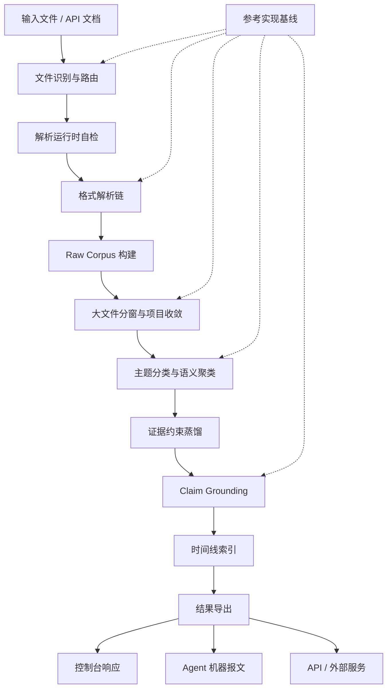

# Pact 知识蒸馏系统：全链路算法升级计划

状态：章节化落地版调整计划
日期：2026-05-31
版本：v2.1
适用范围：内建知识蒸馏、独立知识蒸馏服务、控制台、智能体 API、导出链路

---

## 0. 文档定位

本文件是 Pact 知识蒸馏能力的整改计划，不是单点修补清单。目标是把当前偏“文件解析 + LLM 总结”的链路，升级为单机可部署、证据可追溯、算法可验证、智能体可直接调用的知识提炼系统。

本文作为后续知识蒸馏改造的主执行文档：新增算法、解析器、导出链路、外部服务能力和 verifier，都必须回填到对应章节，避免计划继续分散到临时说明里。

章节粒度就是后续工程推进粒度。每一章都对应一个可实现、可验证、可回滚的系统层级：先把文件可靠变成证据，再把证据变成可检索、可校验、可导出的知识。

章节写法固定为五段：目标、现状问题、改进动作、落地位置、验收门禁。已经落地的能力写入“当前可用基线”，尚未完成的能力写入“后续调整落点”，避免把可用 baseline、设计目标和临时补丁混在一起。

本计划覆盖以下边界：

- 内建模块：`server/platform/specialized/knowledge/`
- Tika 与文件归一化：`server/platform/modules/knowledge/file-processor/`
- 控制台工作台：`server-web/components/KnowledgeDistillationWorkbench.vue`
- 外部服务：`external-services/knowledge-distillation-service/`
- 平台注册：`server/platform/specialized/knowledge/invocation/external-distillation-service/`
- 验证脚本：`server/scripts/verify-*knowledge*distillation*.mjs`

---

## 1. 总体目标

知识蒸馏必须成为 Pact 平台的基础能力，而不是依赖人工补救的附属工具。

核心目标：

- 文件进入系统后先路由，再解析，最后蒸馏。
- 大文件、扫描件、字体异常 PDF、Office、邮件、图片和结构化文件都有明确处理路径。
- raw corpus 为空时硬拦截，禁止假成功。
- 蒸馏结果必须携带来源、时间线、证据、置信度和失败边界。
- 控制台输出面向用户，智能体输出机器可读。
- 内建能力和外部服务明确命名，外部能力统一使用 `external.*`。
- 单机部署可运行，OrbStack 容器可验证，离线包可自检。

---

## 2. 总体架构



### 2.1 章节执行索引

每一层都按“契约先行、运行时落地、回归验证”推进。后续实现和评审以章节为单位推进，每个章节固定回答四件事：问题是什么、怎么调整、落到哪些文件、用什么 verifier 退出。

| 章节 | 层级 | 交付件 | 核心验证 |
| --- | --- | --- | --- |
| 4 | 输入路由 | `FileRoutingPlan`、格式矩阵、Tika 前置分流 | 文本/配置直读、PDF 子类型识别、压缩包不误送单文件解析 |
| 5 | 运行时 | runtime doctor、单机依赖矩阵、容器健康检查 | 本机、OrbStack、离线包输出一致能力状态 |
| 6 | 解析链 | `ParseResult`、parser trace、PDF/OCR 降级链 | 正常 PDF、扫描 PDF、字体异常 PDF 状态可区分 |
| 7 | Raw Corpus | 证据字段标准、空输入门禁、质量标记 | `EMPTY_RAW_CORPUS` 不进入蒸馏 |
| 8 | 大文件 | 分块上传、流式解析、结构窗口、overlap 合并 | 超窗口样本可完成窗口级和文档级收敛 |
| 9 | 分类 | 主题分组、弱证据池、垃圾隔离 | 混合资料不生成单一混乱总结 |
| 10 | 蒸馏 | embedding 聚类、项目级收敛、增量复用 | 未变窗口可复用，变更窗口可重蒸馏 |
| 11 | Grounding | claim 拆解、evidence top-k、蕴含判定 | 无证据 claim 被标记或拦截 |
| 12 | 时间线 | `eventTime`/`documentTime`/`ingestedAt`/`distilledAt` 四类时间 | 智能体可按时间段、置信度和证据强度过滤 |
| 13 | 响应 | `console`、`agent`、`api` 三类 response profile | 用户不看机器 trace，智能体能读重试动作 |
| 14 | 导出 | Markdown、DOCX、JSON、ZIP、Agent JSON | Word/Xcode/解压工具可打开产物 |
| 15 | 服务边界 | 内建模块与 `external.*` 外部能力共存 | Pact 可注册并调用独立知识蒸馏服务 |
| 16 | 验证 | 样本集、verifier、CI 轻重分层 | 历史故障全部进入回归 |

### 2.2 实施依赖顺序


硬约束：

- 路由、运行时、解析、raw corpus 是 P0 基础层，未完成前不能继续扩大模型蒸馏逻辑。
- 分类、项目收敛、时间线和 grounding 是算法层，必须以 evidence refs 和 verifier 驱动。
- 导出、响应 profile、外部服务注册是产品化层，必须同时覆盖控制台、智能体和普通 API。

### 2.3 当前实现状态与调整落点

这份计划按“已经落地的外部服务基线 + 仍需回填的内建平台能力”组织，避免把可用 baseline 和最终目标混在一起。

| 层级 | 当前可用基线 | 后续调整落点 |
| --- | --- | --- |
| 文件路由 | 外部服务已按 extension/media/source kind 生成 `routePlan` | 内建 file processor 与 Tika 调用前也必须统一 route-first |
| 解析链 | 外部服务已覆盖文本、配置、Markdown block、标记语言、图表、Notebook、源码、diff/patch、日历事件、PDF、OOXML、OpenDocument、EPUB、EML/MSG/MBOX 邮件、压缩包、OCR/Tika fallback，并把 Markdown、markup、OOXML、OpenDocument、EPUB、基础 PDF 文本、PDF text-operator geometry、Word comments/footnotes/endnotes、Word/PowerPoint/OpenDocument table cells、PowerPoint shape geometry、Excel cell coordinates 和 SpreadsheetML formulas 纳入 `document-element-model.v1` | 内建解析器补齐 parser trace、runtime doctor、配置/标记语言/图表/Notebook/源码/变更集/日历文档路由和 PDF 子类型判定 |
| Raw Corpus | 外部服务已用 `EMPTY_RAW_CORPUS` 拦截空语料 | 内建 workbench 同步禁止假成功，并暴露用户/智能体双响应 |
| 大文件 | 外部服务已支持 mounted file refs、streaming JSONL document manifests、archive refs、chunked windowing，并对 mounted Office/OpenDocument/EPUB 结构包执行结构 entry 选择、bounded native parse 和 large-entry streaming fallback | 上传、manifest、解析、蒸馏三层统一流式窗口协议 |
| 分类蒸馏 | 外部服务 baseline 为 `hashing_embedding_window_community_classification_v3`，已输出语义概念主题层级、分组理由、低耦合高内聚指标和垃圾排除原因 | 内建运行时升级 embedding cosine、低耦合高内聚分组和垃圾池 |
| Grounding | 外部服务已做 claim-evidence top-k、冲突证据和 promotion gate | 内建运行时补 claim 级门禁和无证据结论拦截 |
| 时间线 | 表格日期已进入 `timeRange`、`timeConfidence`、`timeSignals` | 扩展到邮件、元数据、正文日期，并提供 agent 查询过滤 |
| 项目收敛 | 外部服务已有 `hierarchical-domain-topic-project-convergence.v3`、project-domain/domainReports、cross-domain links、agent query index、project snapshot、incremental reuse plan 和 project evidence query | 内建知识库接入窗口 hash、增量重算、domain/topic/community/source/time 读模型和项目级 convergence |
| 图证据 | 外部服务已有 graph-lite evidence pack、run evidence query 和跨 run project evidence query | 接入更多智能体检索策略和项目级图谱查询 |
| 导出 | 外部服务产出 Markdown、DOCX、JSON、Agent JSON、snapshot、evidence pack、workspace ZIP，并为 PDF/Word/PowerPoint/Excel/Markdown/OpenDocument 输出专业格式适配矩阵、转换 adapter、质量门禁和风险边界 | 内建继续复用 openability、manifest size/hash、专业格式转换矩阵和 bridge 下载统一规则 |
| 服务边界 | `external.knowledge.distillation` 可作为独立服务注册 | 外部能力继续采用 `external.*` 命名，内建模块保留平台内部名称 |
| 验证 | 已有外部服务、容器和平台注册 verifier | 增补 routing、grounding、timeline、export-openability 全量回归 |

### 2.4 分层边界

| 层级 | 范围 | 不接受的结果 |
| --- | --- | --- |
| 平台边界层 | 内建知识蒸馏、`external.knowledge.distillation`、普通 API、Agent 工具注册 | 内外服务同名、控制台私有接口被智能体直接依赖 |
| 输入路由层 | 文件类型、媒体类型、内容形态、调用函数和 fallback 决策 | 未判断格式就直接交给 Tika 或模型 |
| 解析运行时层 | Java/Tika、PDF 视觉解析、OCR、Office/Archive/Email parser 的能力自检 | 缺依赖时只返回“执行失败” |
| Raw Corpus 层 | 文本、表格、页面、slide、sheet、邮件线程、图表节点和源码 symbol 的证据化 | 空语料继续进入蒸馏并生成假成功 |
| 分窗层 | 页、章节、元素、表格、代码、公式和 overlap 窗口 | 大文件依赖单次内存、单次 Tika 或单次模型上下文 |
| 语义算法层 | 主题分类、聚类、垃圾池、窗口级/文档级/项目级收敛 | 多主题资料被压成一个不可追溯总结 |
| 证据校验层 | claim 拆解、evidence top-k、冲突证据、grounding score | 无证据结论进入核心提炼文档 |
| 时间线层 | `eventTime`、`documentTime`、`ingestedAt`、`distilledAt` 和时间段过滤 | 智能体只能拿全量结果自行扫 JSON |
| 响应导出层 | `console`、`agent`、`api` response profile，Markdown/DOCX/JSON/ZIP/Agent JSON，以及 PDF/Word/PowerPoint/Excel/Markdown 的 format conversion profile | 用户看到机器 trace，智能体拿不到可重试错误码 |
| 部署验证层 | 单机包、OrbStack 容器、离线依赖、轻重 verifier | 只在开发机偶然可用，不能复现 |

---

## 3. 业界参考基线

参考仓库已浅克隆到：

`build/reference-frameworks/knowledge-distillation/`

外部服务通过以下文件暴露同一份基线：

`external-services/knowledge-distillation-service/reference-frameworks.json`

外部服务还通过 `reference-framework-local-checkout-audit.v1` 对上述本地 checkout 做运行时审计：检查路径是否存在、是否为 Git worktree、实际 commit 是否匹配 manifest，并在 `/v1/reference-frameworks`、`/v1/capabilities` 和 `/v1/reference-gap-report` 中暴露 `localAudit`。单机 Docker 镜像默认不打包 1.6G 参考源码时，也必须明确报告 missing，不允许把静态 JSON 当作已完成比对。

| 参考实现 | 对标重点 |
| --- | --- |
| RAGFlow | Deep document understanding、RAG 引擎、Agent 知识库流 |
| MinerU | PDF、Office、扫描件、公式、表格、长文档优化 |
| Docling | 统一文档模型、版面、阅读顺序、表格、公式、OCR |
| LlamaIndex | 文档 Agent、摄取管线、评估与可观测性 |
| Marker | PDF 到 Markdown/JSON 的结构化转换 |
| GraphRAG | 大工程项目的图谱式收敛摘要 |
| Haystack | 生产级管线编排、显式路由、组件化评估 |
| Unstructured | partition、解析 strategy、chunk 与 enrichment |

使用规则：

- 解析策略优先对标 Docling、MinerU、Marker、Unstructured。
- 结构化窗口策略优先吸收 Unstructured `chunk_by_title`、表格隔离 pre-chunk、Docling DocItem label 和 LlamaIndex node metadata。
- 大项目收敛优先对标 GraphRAG、RAGFlow。
- Agent/API 兼容优先对标 LlamaIndex、Haystack。
- GPL 项目只吸收行为模式和测试思路，不复制代码。
- 每个新增 parser、batcher、clusterer、grounding gate、exporter 都要补 verifier。
- 独立服务必须输出 `reference-gap-report-json`，把已吸收模式、baseline 状态和未完成 gap 机器可读化，不能只停留在人工 README 对照。

---

## 4. 输入层：文件识别与全套路由

目标：任何文件在进入 Tika、OCR 或模型之前，都必须生成 `FileRoutingPlan`。

现状问题：

- 过去过度依赖 Tika 自动判断，文本文件可能被包装成 XHTML。
- PDF 没有区分可复制文本、扫描件、图片型 PDF、字体映射异常 PDF。
- 文件类型、调用函数和降级路径没有先验计划。

改进计划：

- 建立统一路由对象：

```json
{
  "declaredType": "application/pdf",
  "sniffedType": "application/pdf",
  "extension": ".pdf",
  "contentShape": "pdf",
  "preferredParser": "pdf.text",
  "fallbackParsers": ["pdf.visual", "ocr.page"],
  "riskFlags": ["font-mapping-risk", "large-file-risk"]
}
```

- 文本与配置类文件默认直读或结构化轻解析：`.md`、`.txt`、`.json`、`.csv`、`.yaml`、`.toml`、`.ini`、`.cfg`、`.conf`、`.properties`、`.env`、代码文件。
- 标记语言文件按元素结构解析：`.html`、`.xhtml`、`.xml`、`.rst`、`.adoc`、`.asciidoc`、`.org`、`.tex`、`.latex`、`.wiki`、`.mediawiki` 提取 heading、list、link、table row、code、citation 和 formula。
- 工程图表类文件结构化解析：`.svg`、`.drawio`、`.mmd`、`.mermaid`、`.puml`、`.plantuml`，提取节点、边、标题和标签。
- Notebook 文件按 cell 结构解析：`.ipynb` 提取 markdown、code 和 output cell。
- 源码文件按静态结构解析：JavaScript、TypeScript、Python、Java、Go、Rust、Swift、Kotlin、C/C++ 提取 import、symbol、entry point 和 TODO，不执行源码。
- 变更集文件按统一 diff 结构解析：`.diff`、`.patch` 提取 changed files、hunks、additions、deletions 和上下文。
- 日历事件文件按 iCalendar/vCalendar 结构解析：`.ics`、`.vcs` 提取事件、待办、开始/结束时间、地点、组织者和描述。
- Office 文件走结构化解析：`.docx`、`.pptx`、`.xlsx`。
- PDF 拆分为 `pdf-text`、`pdf-scanned`、`pdf-font-broken`、`pdf-image-heavy`。
- 邮件走邮件解析器：`.eml`、`.msg`、`.mbox`。
- 图片走 OCR/多模态解析器：`.png`、`.jpg`、`.jpeg`、`.tif`、`.tiff`、`.webp`。
- 压缩包作为 workspace package 处理，不直接送入单文件解析器。

落地位置：

- `server/platform/specialized/knowledge/preprocessing/file-processor/index.mjs`
- `server/platform/modules/knowledge/file-processor/FileNormalizer/Tika/tika.mjs`
- `external-services/knowledge-distillation-service/server.mjs`

验收：

- 同一文件多次路由结果稳定。
- Markdown/TXT/JSON/YAML/TOML/ENV 不再经过 Tika XHTML 路径。
- SVG/draw.io/Mermaid/PlantUML 不再被降级成普通文本或 OCR 图片。
- `.ipynb` 不再作为普通 JSON 摘要，必须保留 cell 类型与执行输出边界。
- 源码不再作为普通文本摘要，必须保留语言、行号、import 和 symbol 边界。
- `.diff/.patch` 不再作为普通文本摘要，必须保留文件级、hunk 级和增删行统计。
- `.ics/.vcs` 必须直接产出 `eventTime` 证据，支持智能体按时间段检索会议、里程碑和变更窗口。
- PDF 路由结果能说明后续是否需要视觉解析或 OCR。

---

## 5. 运行时层：单机依赖与健康检查

目标：解析能力是平台能力，不是用户手工补依赖后的偶然能力。

现状问题：

- macOS 上 bundled JRE 原生库可能被系统策略拒绝加载。
- PyMuPDF/fitz 缺失时视觉解析直接失效。
- OCR 运行时、语言包和模型路径缺少统一 health report。

改进计划：

- 增加 runtime doctor：
  - Java/Tika 可执行性。
  - JRE 原生库签名与加载状态。
  - PyMuPDF/pdfplumber 是否可用。
  - OCR runtime、语言包、模型路径是否可用。
  - Tika timeout 与解析策略配置。
- 单机包默认携带或自动检查：
  - Node server。
  - JRE/Tika。
  - PDF 视觉 Python runtime。
  - OCR runtime 与语言包。
  - 样本解析 smoke test。
- Tika 默认启用硬超时，避免长时间无响应。

落地位置：

- `server/platform/common/platform-core/settings.mjs`
- `server/platform/modules/knowledge/file-processor/FileNormalizer/Tika/tika.mjs`
- `server/scripts/production-readiness-gate.mjs`
- `server/scripts/pack-offline-server.mjs`

验收：

- 本机、OrbStack 容器、离线包都能输出同一能力矩阵。
- 缺依赖时返回结构化错误，不进入模糊失败。

---

## 6. 解析层：多解析器链与降级策略

目标：把“解析失败”拆成可解释、可恢复、可验证的阶段。

统一结果模型：

```json
{
  "parseStatus": "completed",
  "text": "...",
  "blocks": [],
  "tables": [],
  "images": [],
  "warnings": [],
  "errors": [],
  "parserTrace": [],
  "contentQuality": {
    "textCharacters": 12000,
    "ocrCharacters": 3000,
    "confidence": 0.86
  }
}
```

改进计划：

- Tika 负责稳定文本抽取，不承担所有视觉解析。
- PDF 字体映射异常时标记 `PDF_FONT_MAPPING_BROKEN`。
- 图片密集 PDF 默认禁用高风险内嵌图片抽取。
- PyMuPDF 负责页级布局、文本块、图像和表格候选。
- OCR 按页执行，保留页码、语言和置信度。
- OCR 低置信文本只能作为弱证据。
- 解析器日志进入 `parserTrace`，不直接暴露给普通用户。

落地位置：

- `server/platform/modules/knowledge/file-processor/FileNormalizer/Tika/tika.mjs`
- `server/platform/specialized/knowledge/preprocessing/file-processor/index.mjs`
- `server/scripts/verify-document-parser-dry-run.mjs`

验收：

- 字体损坏 PDF 返回字体失败原因和降级尝试结果。
- 扫描 PDF 至少返回页级 OCR trace。
- 空正文不再被当作正常解析结果。

---

## 7. Raw Corpus 层：证据保真与空输入门禁

目标：蒸馏前必须拥有可复核证据。

raw corpus item 标准字段：

```json
{
  "sourceId": "doc-001",
  "documentId": "manual.pdf",
  "page": 12,
  "section": "3.2",
  "text": "...",
  "quality": "strong",
  "parserTraceRef": "trace-001",
  "capturedAt": "2026-05-31T00:00:00.000Z",
  "contentHash": "sha256:..."
}
```

改进计划：

- `rawCorpus.totalCharacters === 0` 时禁止创建蒸馏 run。
- 控制台显示“解析无可用正文”。
- 智能体获得 `EMPTY_RAW_CORPUS` 和 parser trace refs。
- 低质量 OCR 证据必须带置信度。
- 证据水合失败必须进入 metrics 和 warning。

落地位置：

- `server/platform/specialized/knowledge/invocation/knowledge-distillation-runtime/index.mjs`
- `server/platform/specialized/knowledge/invocation/knowledge-distillation-workbench/index.mjs`
- `external-services/knowledge-distillation-service/server.mjs`

验收：

- 空 PDF、扫描 PDF、字体损坏 PDF、正常 PDF 的状态可区分。
- 空语料不能进入“看似成功”的蒸馏阶段。

---

## 8. 大文件层：不限体量的分窗与流式处理

目标：文件上限不再由一次性内存、一次性 Tika 调用或一次性 LLM 上下文决定。

改进计划：

- 上传层支持 chunk/resume，不把大文件完整塞进单次内存处理。
- API 层支持 `rawDocumentsManifestPath`/`rawDocumentsManifestRef` 指向 JSONL 文档清单，服务端逐行读取 manifest，再把每个条目交给 filePath/contentRef 路由，避免大工程把所有文档塞进一次请求体。
- 解析层按页、sheet、slide、section 或 block 流式产出。
- 结构化 ZIP 文件引用按结构 entry 读取：DOCX/PPTX/XLSX/OpenDocument/EPUB 只选择文档 XML/XHTML，不把图片、媒体和无关包内容交给解析器；单个结构 entry 超过边界时进入 `structured-zip.large-entry-stream`，保留文本窗口、错误边界和 parser trace。
- corpus 层按结构边界建立窗口：
  - 默认窗口按字符、页、元素或 block 混合控制。
  - Markdown、标记语言、OOXML、OpenDocument、EPUB、PDF 基础文本块、PDF 文本定位几何、Word 批注/脚注/尾注、Word/PowerPoint/OpenDocument 表格单元格、PowerPoint shape 几何、Excel 单元格坐标、SpreadsheetML 公式和后续 PDF/Office layout block 使用 `document-element-model.v1` 统一表达元素。
  - 标题层级使用 `element-aware-by-title-windowing.v1` 建立窗口，表格、代码、公式保留隔离边界。
  - 普通文本窗口之间保留 overlap；元素窗口保留 `headingPath`、`elementRefs` 和 `boundaryReason`。
  - 每个窗口保留 `contentHash`。
- 蒸馏层按窗口先局部提炼，再做文档级、项目级收敛。
- 超大文件只限制运行资源和策略，不设小尺寸硬上限。

落地位置：

- `server/platform/specialized/knowledge/invocation/knowledge-distillation-workbench/index.mjs`
- `server/platform/specialized/knowledge/invocation/knowledge-distillation-runtime/index.mjs`
- `external-services/knowledge-distillation-service/server.mjs`

验收：

- 大 PDF 不因单次解析 timeout 直接失败。
- 单文档可拆成多个窗口，并能合并为文档级结论。
- verifier 覆盖至少一个超窗口文本样本。

---

## 9. 分类层：多主题分流与垃圾信息隔离

目标：不同主题不能被压成一个混乱总结。

改进计划：

- 对输入文档先做主题分类，再进入蒸馏。
- unrelated 文档进入不同分类组。
- 低相关、低质量、模板化、重复噪声进入 `garbage` 或 `weak-evidence` 池。
- 每个分类组输出：
  - `groupId`
  - `label`
  - `keywords`
  - `sourceIds`
  - `cohesionScore`
  - `evidenceCount`

算法路径：

- 当前独立服务先用确定性 token/Jaccard 做 baseline。
- 后续内建运行时升级为 embedding cosine。
- 大项目再叠加 GraphRAG 风格 community report。

落地位置：

- `external-services/knowledge-distillation-service/server.mjs`
- `server/platform/specialized/knowledge/invocation/knowledge-distillation-runtime/index.mjs`

验收：

- 架构文档、财务票据、运维日志混合输入时至少产生 3 个主题组。
- 垃圾信息不进入核心提炼文档。

---

## 10. 蒸馏层：语义聚类、项目收敛与增量复用

目标：从“LLM 总结器”升级为“证据约束的知识提炼系统”。

改进计划：

- 分批：
  - 以文档、页、章节、slide、sheet 为优先边界。
  - 单文档超大时按结构窗口拆分。
  - 同目录、同来源、同主题优先同批。
- 聚类：
  - 用 embedding cosine 替代字面 Jaccard。
  - 使用 Leader-Clustering。
  - 超出最大 cluster 时进入最相似组或 `unassigned_garbage_pool`。
- 项目收敛：
  - 窗口级摘要。
  - 文档级摘要。
  - 主题组摘要。
  - 项目级决策、风险、实体、时间线收敛。
  - 以 `projectId` 合并多次 run 的 graph evidence，保留 `sourceRunId` 供智能体区分历史证据和当前证据。
- 增量复用：
  - 以 `contentHash` 判断未变窗口。
  - 未变 cluster 复用上一轮结果。

落地位置：

- `server/platform/specialized/knowledge/invocation/knowledge-distillation-runtime/index.mjs`
- `server/platform/specialized/knowledge/storage/knowledge-core/index.mjs`

验收：

- 多主题工程样本不再产出单一巨型 cluster。
- 未变内容重复蒸馏时能复用缓存。

---

## 11. Grounding 层：Claim-Evidence 事实校验

目标：每条关键结论都能回到原始证据。

改进计划：

- 将蒸馏输出拆成原子 claims。
- 为每条 claim 检索 top-k evidence。
- 判定 claim 与 evidence 的关系：
  - `entailed`
  - `contradicted`
  - `neutral`
- 计算 `groundingScore`。
- 低分输出进入不确定项，不写入核心知识。
- OCR 低置信内容不能单独支撑高置信结论。

落地位置：

- `server/platform/specialized/knowledge/invocation/knowledge-distillation-runtime/index.mjs`
- `server/scripts/verify-knowledge-distillation-workbench.mjs`

验收：

- 故意注入无证据 claim 时必须被拦截。
- 每个最终 finding 至少包含一个 evidence ref。

---

## 12. 时间线层：时间段检索与噪声排除

目标：智能体按时间段查询时，能精确筛选有效信息并排除无关噪声。

改进计划：

- 每个 evidence item 维护四类时间：
  - `eventTime`: 文档内容描述的事件时间。
  - `documentTime`: 文档自身创建、修改、邮件发送或报告日期。
  - `ingestedAt`: 进入 Pact 的时间。
  - `distilledAt`: 蒸馏产物生成时间。
- 时间解析保留来源：
  - 文件元数据。
  - 邮件头。
  - 文档正文日期。
  - 用户上传上下文。
- 时间线索引字段：
  - `timeRange`
  - `timeConfidence`
  - `timeEvidenceRef`
  - `timezone`
  - `ambiguityFlags`
- 智能体查询支持：
  - `from`
  - `to`
  - `timeField`
  - `confidenceMin`
  - `excludeWeakEvidence`
- Agent evidence query 不返回完整大 JSON 后再让智能体自扫；服务侧必须先按时间、实体、claim 状态和 evidence 强度过滤。

落地位置：

- `server/platform/specialized/knowledge/storage/knowledge-core/index.mjs`
- `server/platform/specialized/knowledge/invocation/knowledge-distillation-runtime/index.mjs`
- `external-services/knowledge-distillation-service/server.mjs`

验收：

- 查询某一时间段时，结果按 `eventTime` 或 `documentTime` 可切换。
- 无日期、低置信日期、模板日期不污染强时间线。
- 智能体请求同一时间段时，返回结果数量、过滤条件和被排除原因可机器读取。

---

## 13. 响应层：控制台、智能体与 API 分离

目标：同一任务对不同调用方输出不同形态。

响应 profile：

| Profile | 使用者 | 输出重点 |
| --- | --- | --- |
| `console` | 管控台用户 | 简短状态、失败摘要、下一步建议 |
| `agent` | 智能体 | 错误码、trace refs、routePlan、evidence refs |
| `api` | 普通接口调用 | 稳定 JSON contract |

统一错误码：

- `TIKA_RUNTIME_DENIED`
- `PDF_FONT_MAPPING_BROKEN`
- `PDF_VISUAL_RUNTIME_MISSING`
- `OCR_NO_TEXT`
- `EMPTY_RAW_CORPUS`
- `DISTILLATION_INPUT_UNSUPPORTED`
- `GROUNDING_FAILED`

落地位置：

- `server-web/components/KnowledgeDistillationWorkbench.vue`
- `server/platform/specialized/knowledge/invocation/knowledge-distillation-workbench/index.mjs`
- `server/platform/specialized/knowledge/invocation/external-distillation-service/index.mjs`
- `external-services/knowledge-distillation-service/server.mjs`

验收：

- 控制台不展示长 Java stack trace。
- 智能体能直接读取机器可重试动作和 trace refs。
- 普通 API 不依赖控制台桥接逻辑。
- 智能体可通过专用 evidence query 读取裁剪后的 text units、entities、relationships、claims 和 community reports。
- 智能体可通过 project evidence query 按 `projectId`、domain、route、时间段、实体、claim 状态和来源过滤跨 run 项目证据。

---

## 14. 导出层：可打开、可复核、可下载

目标：产物不是“看起来生成了”，而是能被常见工具打开。

导出格式：

- Markdown：核心提炼文档。
- DOCX：Word 可打开文档。
- JSON：机器可读结构化结果。
- Format Conversion Plan JSON：每个输入文档的专业解析与格式转换计划。
- ZIP：完整工作区包。
- Agent JSON：智能体专用报文。

改进计划：

- DOCX 必须使用合法 OpenXML，不写伪文档。
- ZIP manifest 记录文件大小、hash 和 media type。
- Markdown 不允许包含 Tika XHTML 噪声。
- PDF、Word、PowerPoint、Excel、Markdown、OpenDocument 必须进入 `office-document-professional-adaptation.v1` 格式矩阵，声明 parser stages、structure units、conversion adapters、preserves、quality gates、risk controls 和 known losses。
- 每个文档的 `formatConversionPlan.documents[]` 必须能说明转换到 Markdown、DOCX、Agent JSON 和 evidence pack 时保留什么、丢失什么、如何验收可打开性。
- 每个文档必须输出 `qualityGateResults`，把页面顺序、bbox、Word 表格/批注、PPT slide/shape、Excel sheet-row-cell/formula/time-index、Markdown heading/table、OpenDocument content/table 变成可机读的 pass/warning/fail/not_applicable。
- `formatConversionPlan.outputArtifactValidation` 必须对实际导出的 Markdown/DOCX 做自检，DOCX 至少验证 ZIP 可读、OpenXML 必需部件、WordprocessingML content type、`word/document.xml` body 和文本节点。
- 下载链路统一走 bridge-mediated fetch/blob。
- 下载 UI 显示文件大小。

落地位置：

- `server-web/lib/bridge.ts`
- `server-web/components/KnowledgeDistillationWorkbench.vue`
- `server/platform/specialized/knowledge/invocation/knowledge-distillation-workbench/index.mjs`
- `external-services/knowledge-distillation-service/server.mjs`

验收：

- Markdown、DOCX、JSON、ZIP 均可打开。
- `format-conversion-plan-json` 能按 PDF/Word/PowerPoint/Excel/Markdown 精确列出专业 adapter、质量门禁评估、openability 状态和输出 artifact 自检结果。
- 浏览器下载记录不再出现失败项。
- 文件大小与 manifest 一致。

---

## 15. 服务边界层：内建能力与外部服务

目标：内部深度嵌合能力和外部独立服务可以共存。

命名规则：

- 内建模块继续使用现有知识蒸馏模块名。
- 外部服务统一使用 `external.*`。
- 当前外部知识蒸馏服务名：`external.knowledge.distillation`。
- 后续外部能力示例：
  - `external.icloud`
  - `external.mail`
  - `external.gmail`
  - `external.onedrive`

调用边界：

- 控制台可以调用内建能力或已注册外部服务。
- 智能体可直接访问授权后的 `external.knowledge.distillation`。
- 普通 API 可绕过控制台和智能体，直接使用稳定接口。

落地位置：

- `external-services/knowledge-distillation-service/`
- `server/platform/specialized/knowledge/invocation/external-distillation-service/`
- `server/platform/specialized/capabilities/tools/tool-management-core/catalog.mjs`
- `server/platform/common/operation-dispatcher/operation-registry.mjs`

验收：

- 新 OrbStack 容器能启动独立服务。
- Pact 平台能注册并调用外部服务。
- 智能体工具目录可发现并调用该能力。

---

## 16. 验证层：样本集与回归门禁

目标：每次修复都进入可重复验证，不靠人工感觉判断。

样本集：

- 正常文本 PDF。
- 字体映射损坏 PDF。
- 扫描 PDF。
- 图片密集 PDF。
- Markdown/TXT/JSON/YAML/TOML/INI/ENV/properties。
- SVG/draw.io/Mermaid/PlantUML 工程图。
- Jupyter Notebook `.ipynb`。
- 源码结构样本：`.ts`、`.py`、`.go`、`.rs`。
- Git 变更集样本：`.diff`、`.patch`。
- 日历事件样本：`.ics`、`.vcs`。
- DOCX/XLSX/PPTX。
- EML/MSG/MBOX。
- 大文件样本。
- 多主题混合样本。
- 噪声样本。

Verifier：

- `verify-document-parser-dry-run`
- `verify-knowledge-distillation-workbench`
- `verify-external-service-api-registration`
- `verify-external-knowledge-distillation`
- 新增 `verify-distillation-routing`
- 新增 `verify-distillation-grounding`
- 新增 `verify-distillation-export-openability`
- 新增 `verify-distillation-timeline-filtering`

验收：

- CI 跑轻量样本。
- 本地全量 verifier 跑重样本。
- 每个历史故障都有固定回归用例。

---

## 17. 分层落地路线

| 阶段 | 覆盖章节 | 优先级 | 交付焦点 | 退出条件 |
| --- | --- | --- | --- | --- |
| P0-A | 4 | 最高 | 文件路由、Tika 前置分流、文本直读 | 所有支持格式先生成 `routePlan` |
| P0-B | 5-6 | 最高 | runtime doctor、PDF 视觉/OCR 自检、parser trace | 缺依赖可解释，正常 PDF、扫描 PDF、字体异常 PDF 状态可区分 |
| P0-C | 7 | 最高 | raw corpus 空输入硬门禁、证据字段标准 | `EMPTY_RAW_CORPUS` 稳定返回，不再假成功 |
| P0-D | 13-14 | 最高 | 控制台/智能体/API 响应分离，DOCX/ZIP/Markdown/JSON 下载可打开 | 下载成功，产物可被 Word、Xcode 和解压工具打开 |
| P1-A | 8 | 高 | 大文件分窗、流式解析、窗口合并 | 超窗口样本可完成窗口级和文档级蒸馏 |
| P1-B | 9-10 | 高 | 分类蒸馏、embedding 聚类、垃圾隔离、项目级收敛 | unrelated 输入可分组，噪声不进入核心提炼 |
| P1-C | 11 | 高 | Claim grounding、证据 top-k、冲突门禁 | 无证据 claim 被拦截，最终 finding 有 evidence refs |
| P1-D | 12 | 高 | 四类时间字段、时间段过滤、弱证据排除 | 智能体可按时间、置信度、证据强度精确检索 |
| P2-A | 10 | 中 | 增量蒸馏、窗口 hash、跨 run 项目收敛 | 未变内容复用缓存，变更窗口可重蒸馏 |
| P2-B | 15 | 中 | `external.knowledge.distillation` 独立服务、平台注册、Agent 工具目录 | OrbStack 单机容器可运行，Pact 可注册并调用 |
| P2-C | 16 | 中 | 全量样本集、轻重 verifier、CI 门禁 | 历史故障全部进入固定回归 |

### 17.1 第一轮执行顺序

第一轮不按“改一点点 UI”推进，而按系统链路闭环推进：

1. 路由与运行时：先统一 `FileRoutingPlan`、runtime doctor、parser trace 和空语料门禁。
2. 解析与证据：补齐 PDF/Office/Email/Archive/Markup/Notebook/Source/Diff/Calendar 的结构化证据模型。
3. 大文件与分窗：把页、章节、元素、表格、代码、公式统一纳入窗口模型，消除小文件上限。
4. 算法与校验：引入主题分类、聚类、垃圾池、claim grounding、冲突证据和时间线过滤。
5. 响应与导出：分离控制台、Agent、普通 API 报文，并验证 Markdown/DOCX/JSON/ZIP 可打开。
6. 服务与门禁：外部服务注册为 `external.knowledge.distillation`，OrbStack 单机容器、reference framework checkout audit 和 verifier 固化为回归门禁。

---

## 18. 文档维护规则

- 算法实现、文件格式支持、导出格式和外部服务 API 变更，必须更新对应章节。
- 新增历史故障必须补充到第 16 章样本集或 verifier 列表。
- 新增外部能力继续使用 `external.*` 命名，并同步更新第 15 章。
- 不新增平行的知识蒸馏长期计划文档；确有阶段记录时，最终结论回填本文。

---

## 19. 成功判定

该计划完成后，知识蒸馏应满足：

- 支持格式有明确路由，不再把 Tika 当万能入口。
- 大文件通过分窗和流式处理进入蒸馏，不被小尺寸上限挡住。
- 解析失败有错误码、trace 和降级说明。
- raw corpus 为空时不进入蒸馏。
- 多主题资料能分类提炼，噪声不会污染核心结果。
- 每条关键结论有证据来源和 grounding 状态。
- 智能体能按时间段检索并排除弱证据。
- 控制台、智能体、API 三类响应互不混淆。
- Markdown、DOCX、JSON、ZIP 可下载、可打开、可复核。
- 内建能力和 `external.knowledge.distillation` 均可单机部署和验证。
