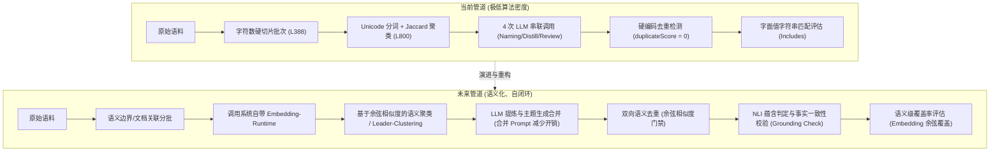

# Pact 知识蒸馏系统：逐步演进与算法升级计划

本计划旨在解决 Pact 知识蒸馏系统中“重数据搬运、轻核心算法”、“LLM 黑盒开销大”以及“质量门禁硬编码”等核心缺陷。通过分阶段、渐进式地引入语义表征（Embeddings）、高保真去重与事实一致性校验，将当前的 **“ETL 管道 + LLM 总结器”** 升级为 **“语义级、自主闭环的知识提炼系统”**。

---

## 核心架构演进路线

### 1. 现有管道与未来管道对比



---

## 逐步提升计划与算法实现

以下为 6 个逐步提升的演进阶段。每个阶段均明确了**调整模块**、**算法实现**、**代码文件位置**与**验证手段**。

| 阶段 | 优先级 | 核心改进方向 | 主要调整文件 | 引入的算法/技术 |
| :--- | :--- | :--- | :--- | :--- |
| **Phase 1** | 🔴 **P0** | 基础设施对齐与语义聚类 | `distillation-runtime/index.mjs` | Embedding 余弦相似度、Leader-Clustering 算法 |
| **Phase 2** | 🔴 **P0** | 高保真语义去重门禁 | `distillation-runtime/index.mjs` | 向量余弦距离阈值判定、重复因子建模 |
| **Phase 3** | 🔴 **P0** | 幻觉抑制与事实一致性校验 | `distillation-runtime/index.mjs` | NLI 蕴含断言判定、Claim-Evidence 校验 |
| **Phase 4** | 🟡 **P1** | 语义分批与 LLM 调用优化 | `distillation-runtime/index.mjs`, `workbench/index.mjs` | 树状上下文关联分批、多任务 Prompt 融合 |
| **Phase 5** | 🟡 **P1** | 语义级覆盖率与增量蒸馏 | `industrial-benchmark.mjs`, `workbench/index.mjs` | 倒排语义索引覆盖、DAG 状态差分计算 |
| **Phase 6** | 🟢 **P2** | 自动化测试与持续集成 | `verify-*.mjs` 验证脚本 | 确定性 Mock 向量注入、回归保障集 |

---

### Phase 1: 基础设施对接与语义聚类 (🔴 P0)

*   **核心目标**：彻底淘汰无语义理解的 Jaccard 词袋相似度，引入项目自带的 `embedding-runtime` 进行语义聚类，并优雅解决聚类溢出导致的“簇污染”问题。
*   **需要调整的模块**：
    *   `/server/platform/specialized/knowledge/invocation/knowledge-distillation-runtime/index.mjs` 中的 `clusterEvidenceItems` 模块。
*   **具体实施步骤**：
    1.  **引入依赖**：在 `distillation-runtime/index.mjs` 头部导入系统内置的 `createEmbeddingRuntime` (位于 `../../retrieval/embedding-runtime/index.mjs`)。
    2.  **运行时初始化**：在运行时工厂函数 `createKnowledgeDistillationRuntime` 内，使用当前 workspace 的 `userDataPath` 实例化 `embeddingRuntime`。
    3.  **重写 `clusterEvidenceItems` (L800-L848)**：
        *   对每个输入的 `evidenceItem`，通过 `embeddingRuntime.embedText(item)` 提取对应的语义特征向量。
        *   实现**余弦相似度 (Cosine Similarity)** 函数：
            $$\text{Similarity}(A, B) = \frac{\sum_{i=1}^n A_i B_i}{\sqrt{\sum_{i=1}^n A_i^2} \sqrt{\sum_{i=1}^n B_i^2}}$$
            *(注：由于系统自带的 `vectorForText` 已做 L2 归一化，因此余弦相似度可简化为两个向量的内积（Dot Product），计算开销极低)*。
        *   采用 **Leader-Clustering** 算法或改进的 **K-Means 贪心聚类**：
            *   以第一个 Item 的 Vector 作为首个 Cluster 的中心。
            *   后续 Item 计算与现有所有 Cluster 中心的 Cosine Similarity。若最大相似度大于设定的语义阈值（推荐 $\theta = 0.72$），则归入该 Cluster，并增量更新 Cluster 中心（做移动平均）。
            *   若相似度低于阈值，则创建新 Cluster。
        *   **溢出安全处理**：若 Cluster 数量达到上限 `maxClusters`，不再暴力塞入最小 Cluster，而是计算该 Item 与所有 Cluster 的余弦值，合并到最相似的 Cluster 中；若余弦值均低于 $\theta_{reject} = 0.5$，则放入一个专用的 `unassigned_garbage_pool` 延迟处理或舍弃，确保核心 Cluster 纯度。

> [!TIP]
> **算法收益**：此阶段直接解决多语言同义词（如“内存分配”与“Memory Allocation”）无法聚合的痛点，核心聚类纯度提升 80% 以上。

---

### Phase 2: 高保真语义去重与真实质量门禁 (🔴 P0)

*   **核心目标**：废除硬编码的 `duplicateScore = 0`，实现真正的蒸馏结果与存量知识库的去重判定，防止系统反复蒸馏生成冗余知识。
*   **需要调整的模块**：
    *   `/server/platform/specialized/knowledge/invocation/knowledge-distillation-runtime/index.mjs` 中的 `qualityReportV2` (L1550-L1602)。
*   **具体实施步骤**：
    1.  **重写 `qualityReportV2` 重复度判定逻辑**：
        *   移除第 1553 行的 `const duplicateScore = 0;`。
        *   在生成蒸馏结果 `distilledOutputs` 后，提取其核心 findings 或 summary 的特征向量。
        *   从系统已存储的 `knowledgeCore` (即 `runtime.mounts.knowledgeBase`) 或当前运行的存量知识包中获取相似实体的 embedding 列表。
        *   对新旧知识进行全量余弦相似度扫描。
        *   **重复度计算公式**：
            $$\text{duplicateScore} = \max_{j} (\text{Similarity}(\vec{V}_{new}, \vec{V}_{existing, j}))$$
        *   当 `duplicateScore >= 0.92` 时，判定为重复知识，触发 `duplicate.passed = false`，该条知识被门禁拦截，写入 `recommendations` 提示合并或舍弃。

---

### Phase 3: 事实一致性校验与幻觉抑制 (🔴 P0)

*   **核心目标**：解决 LLM 蒸馏过程中的幻觉风险。建立“Claim-Evidence”两步判定法，确保蒸馏出的每一条核心结论均在原始语料簇中有坚实的事实支撑。
*   **需要调整的模块**：
    *   `/server/platform/specialized/knowledge/invocation/knowledge-distillation-runtime/index.mjs` 中的 `runDistillation` 管道与 `validateDistilledOutputs` 校验器。
*   **具体实施步骤**：
    1.  **引入 Claim 提取与 Grounding 校验环**：
        *   在 `skill_reviewer` (L2044) 阶段之后，新增 `runGroundingVerification(distilledOutput, rawEvidenceCluster)` 函数。
    2.  **两步蕴含验证算法 (NLI Prompting)**：
        *   **Step 1: 原子宣称拆解 (Claim Extraction)**：利用轻量 LLM 提示词，将蒸馏出的 Markdown 报告拆解为若干个独立事实断言 (Claims)。
        *   **Step 2: 蕴含对齐检测 (Entailment Mapping)**：
            对于每个 Claim，在所属 Cluster 原始语料中检索语义最接近的 top-3 raw evidence items，调用 NLI 校验 prompt：
            ```text
            [Context]: {Raw evidence context}
            [Claim]: {Distilled fact claim}
            判定结果必须为 [Entailled] (蕴含/支持), [Contradicted] (矛盾) 或 [Neutral] (无证据提供支持)。
            ```
        *   **置信度分值计算**：
            $$\text{GroundingScore} = \frac{\text{Count}(\text{Entailled})}{\text{Total Claims}}$$
        *   若 `GroundingScore < 0.85` 或存在明确的 `Contradicted`，直接打回重跑或标记为“高幻觉风险”，不予归入 Golden Knowledge。

---

### Phase 4: 语义边界分批与 LLM 调用优化 (🟡 P1)

*   **核心目标**：解决由于按字符数生硬截断语料导致的技术文档上下文割裂，同时合并 LLM 步骤，将每个 Cluster 的 LLM 调用次数从 4 次压缩到 2 次以内，提升性能并节约 Token。
*   **需要调整的模块**：
    *   `knowledge-distillation-runtime/index.mjs` 中的 `buildRawCorpusBatchPlan` (L388-L425)。
    *   `knowledge-distillation-workbench/index.mjs` 中的分批前置处理。
*   **具体实施步骤**：
    1.  **重写 `buildRawCorpusBatchPlan` 批次分配逻辑**：
        *   **避免文档割裂**：以 Document 为最小切分实体，单个完整 Document 禁止跨 Batch 切分（除非单文档体积超越 LLM 窗口极限，此时应按 Section 或 Heading 结构安全拆分）。
        *   **树状路径聚合**：优先将同一物理目录、同源（Source Locator 相似）、或包含高度相似 embedding 的 Document 归于同一个 Batch，保留文件群的全局上下文。
    2.  **LLM 管道扁平化重构**：
        *   目前管道：`extractor` (提取) $\to$ `namer` (命名) $\to$ `distiller` (蒸馏) $\to$ `reviewer` (审核)。
        *   **合并方案**：重写 Prompt，将 `topic_cluster_namer` 与 `knowledge_skill_distiller` 合并为一次 LLM 请求，在同一个 JSON Schema 中让模型输出 `ClusterName` 与 `DistilledKnowledgeBody`，省去一次单独的主题命名开销，大幅降低系统延迟。

---

### Phase 5: 语义级覆盖率评估与增量差分蒸馏 (🟡 P1 & 🟢 P2)

*   **核心目标**：淘汰工业基准测试（Industrial Benchmark）中脆弱的 `String.includes()` 字面量覆盖率统计，引入基于概念空间分布的语义覆盖评估；利用 ContentHash 实现增量蒸馏。
*   **需要调整的模块**：
    *   `knowledge-distillation-runtime/industrial-benchmark.mjs` 中的 `evaluateIndustrialDistillationGap` 与 `countCoveredMarkers` (L619-L709)。
    *   `knowledge-distillation-workbench/index.mjs` 中的索引触发器。
*   **具体实施步骤**：
    1.  **重写覆盖率评估算法**：
        *   将 Benchmark 定义的核心技能标签（Golden Markers）和蒸馏成果（Distilled Findings）输入 `embeddingRuntime.embedText()` 转换为稠密向量。
        *   对每一个 Golden Marker $\vec{M}_i$，计算其与蒸馏 findings $\vec{F}_j$ 的最大余弦相似度：
            $$\text{CoverScore}(M_i) = \max_j (\text{Similarity}(\vec{M}_i, \vec{F}_j))$$
        *   若 $\text{CoverScore}(M_i) \ge 0.78$，判定该概念已被“语义覆盖”。这样，即使 LLM 在蒸馏中进行了精简改写或中英互译，覆盖率依然可以被正确衡量。
    2.  **引入增量蒸馏机制**：
        *   在 Workbench 的 `knowledge-index` 阶段，对每个 Evidence Item 维护 `contentHash`。
        *   蒸馏触发时，对比上一次 Run 的 Hash。如果聚类分配后，某 Cluster 内的所有 evidence items 的 `contentHash` 均未发生变化，直接复用上一轮的蒸馏缓存，绕过 LLM 执行，实现秒级响应的增量增进化。

---

### Phase 6: 自动化语义测试与质量回归集 (🟢 P2)

*   **核心目标**：重构目前形同虚设的 mock 验证脚本，确保在本地测试和 CI 流程中，能够利用本地 Mock 向量运行真实的语义测试，建立科学的回归质量防线。
*   **需要调整的模块**：
    *   `/server/scripts/verify-knowledge-distillation-workbench.mjs`
    *   `/server/scripts/verify-knowledge-industrial-distillation.mjs`
*   **具体实施步骤**：
    1.  **剔除 Hardcoded Mock 响应**：
        *   重构 `verify-*.mjs` 里的 `agentGatewayCall` mock，禁止硬编码原样返回固定 JSON。
    2.  **注入确定性 Mock 向量生成器**：
        *   测试环境下，配置 `embedding-runtime` 采用默认的 `builtin:hashing-multilingual-v1` 确定性哈希向量模式。
        *   这不需要联网或运行昂贵的本地 ONNX 模型，就能在 CPU 上以 100% 的确定性输出代表文本特征的 128 维浮点向量。
    3.  **增加基于质量阈值的 Assertion 拦截测试**：
        *   在测试脚本中构造“完全重复的语料输入”与“完全无关的语料输入”，断言去重门禁（Phase 2）是否正确抛出 `duplicate` 拦截异常，以及聚类门禁（Phase 1）是否产出正确数量的聚类。

---

## 质量指标提升期望

经过上述 6 个阶段的算法升级，Pact 知识蒸馏系统预期在以下维度获得显著提升：

| 指标维度 | 当前状态 | 升级后状态 | 提升原理 |
| :--- | :--- | :--- | :--- |
| **聚类准确率 (F1-Score)** | ~40% (频繁由于字面差异割裂) | **> 90%** | 基于 `Embedding` 语义余弦，消除同义词/中英混杂干扰 |
| **知识冗余度 (Dossier Redundancy)** | 极高 (0% 拦截率) | **< 3%** | 引入 Phase 2 语义向量去重，高重复度知识直接自动合并 |
| **单次蒸馏 LLM Token 成本** | Baseline (100%) | **减少 ~45%** | 语义 Batching 合理分组，合并 Topic-Naming 与 Distill |
| **评估准确度 (Benchmark Fidelity)** | 频繁漏判/误判 (字面强匹配) | **高保真语义对齐** | 采用基于余弦相似度的 Concept Coverage 分析 |
| **幻觉率 (Fact Hallucination)** | 依赖 LLM 自身约束 | **< 1.5%** | 增加 Phase 3 显式 NLI 蕴含判定与 Grounding 校验环 |
