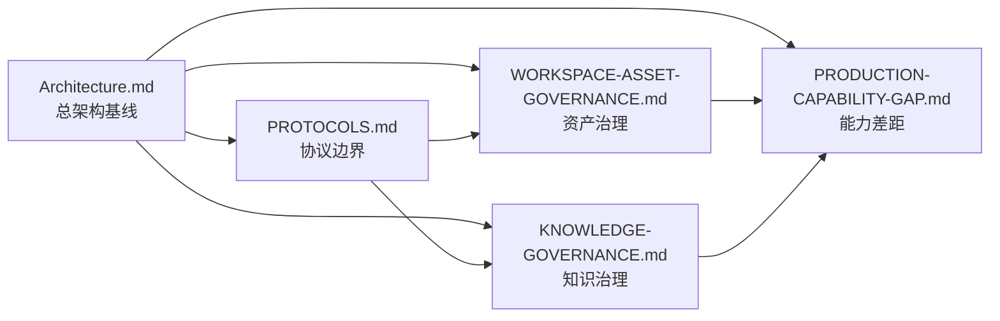

# AgentStudio Docs

> Documentation index for AgentStudio — a controllable agent collaboration space.
>
> AgentStudio 文档索引 — 可控的智能体协作空间。

本文档目录分为核心设计文档和运行支持文档。新的长期架构决策只能进入核心设计文档，避免重新扩散成多份互相漂移的设计说明。

This directory is organized into **Core Design Documents** and **Operational Documents**. New long-term architectural decisions must be merged into one of the core documents to prevent fragmentation.

---

## 核心设计文档 / Core Design Documents

当前核心设计文档固定为五份 / Fixed to five authoritative documents:

| Document | 文档 | Description | Size |
| --- | --- | --- | --- |
| [Architecture.md](Architecture.md) | 架构总览 | System positioning, design scope, requirements, module design, data models, deployment | 54 KB |
| [PROTOCOLS.md](PROTOCOLS.md) | 协议边界 | Workspace API, Operation, Tool Management, Knowledge, and protocol adapter boundaries | 29 KB |
| [WORKSPACE-ASSET-GOVERNANCE.md](WORKSPACE-ASSET-GOVERNANCE.md) | 工作空间资产治理 | Public workspace asset governance, snapshots, traceability, restore, copy, and security principles | 37 KB |
| [KNOWLEDGE-GOVERNANCE.md](KNOWLEDGE-GOVERNANCE.md) | 知识治理 | Knowledge evidence, 3-layer knowledge model, agent-citable context, and knowledge maintenance loop | 19 KB |
| [PRODUCTION-CAPABILITY-GAP.md](PRODUCTION-CAPABILITY-GAP.md) | 生产能力差距 | Production capability gaps, acceptance gates, and current blockers | 38 KB |

### Document Dependencies / 文档依赖

---

## 运行支持文档 / Operational Documents

| Document | 文档 | Description | Size |
| --- | --- | --- | --- |
| [SERVER.md](SERVER.md) | 服务端指南 | Server startup, runtime, protocols, packaging, and operations | 57 KB |
| [USAGE.md](USAGE.md) | 使用说明 | Console, client, and CLI usage guide | 7 KB |
| [FEATURE-PROFILES.md](FEATURE-PROFILES.md) | Feature Profile | Feature profile planning, trimming, and build commands | 2 KB |
| [IMPLEMENTATION-DECISION-REGISTER.md](IMPLEMENTATION-DECISION-REGISTER.md) | 设计决策登记表 | Pre-implementation design decisions; finalized conclusions must be merged back into core docs | 33 KB |
| [ENTITY-CONFIG-LAYOUT.md](ENTITY-CONFIG-LAYOUT.md) | 实体配置目录 | Human-maintainable entity config directory, lightweight skill packs, and validation | 2 KB |
| [TEST-FRAMEWORK.md](TEST-FRAMEWORK.md) | 测试框架 | Unified test framework contract | 6 KB |
| [DEVELOPER-GUIDELINES.md](DEVELOPER-GUIDELINES.md) | 开发者核心守则 | Coding conventions, architecture principles, and design philosophy | 5 KB |
| [GIT-COLLAB.md](GIT-COLLAB.md) | Git 协作约定 | Local collaboration conventions | 2 KB |
| [testing/memory-and-smoke-framework.md](testing/memory-and-smoke-framework.md) | 记忆与 Smoke 测试 | Memory and smoke test framework guide | < 1 KB |

---

## 维护规则 / Maintenance Rules

- 不再新增横向设计文档；新设计必须合并到五份核心文档之一。
  *No new lateral design documents. New designs must be merged into one of the five core documents.*
- 旧设计说明如果仍有价值，先合并为核心文档章节，再删除旧文件。
  *Legacy design documents with remaining value must be merged as a section of a core document, then deleted.*
- 操作说明、命令说明、配置说明可以保留为运行支持文档，但不得承载新的架构决策。
  *Operational docs may contain instructions and configurations, but must not carry new architectural decisions.*
- 生成物不进入 `docs/`。需要长期维护的图、报告或导出必须转成可审阅的 Markdown 设计或运行文档。
  *Generated artifacts do not belong in `docs/`. Long-lived diagrams, reports, or exports must be converted to reviewable Markdown.*
